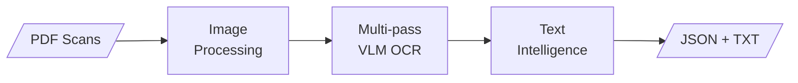

<div align="center">


# NASA Transcript Processing Pipeline

*Digitizing Apollo Mission Communications for the Modern Era*

</div>

## About This Project

Passionate about space exploration and the Apollo missions, I wanted to create something meaningful while learning to work with modern AI coding agents. This pipeline transforms scanned NASA transcript PDFs into structured, searchable data—preserving these historic communications for researchers and space enthusiasts.

**What drives this project:**
- 🚀 Deep fascination with space exploration and Apollo mission history
- 🤖 Hands-on learning with AI-powered development tools (LLMs, vision models, coding agents)
- 📚 Making historic space communications more accessible and analyzable
- 🛠️ Building something concrete that combines classic engineering with cutting-edge AI

---

## Overview

A specialized pipeline for digitizing scanned NASA Apollo mission transcripts. Combines intelligent image enhancement with Vision-Language Model (VLM) OCR to produce structured, searchable transcripts.



## Features

| Feature | Description |
|:--------|:------------|
| **Smart Image Enhancement** | Deskew, normalization, noise removal, and contrast optimization |
| **Multi-pass OCR** | Primary + raw + faint fallback passes with intelligent merge |
| **Structured Parsing** | Extracts timestamps, speakers, locations, and dialogue |
| **Advanced Timestamp Correction** | Day correction (94→04), hour snapping, sequence reset detection, OCR noise normalization |
| **Intelligent Tape Validation** | 🎯 **100% accuracy** — Hybrid OCR + dead reckoning with automatic error correction |
| **Speaker & Location Validation** | Fuzzy matching, OCR fixes, manual corrections by timestamp, invalid annotation filtering |
| **Text Intelligence** | Lexicon-based spell-checking, regex replacements, hyphenated technical terms |
| **Fast Iteration** | Reparse from cached OCR in 1-2 min (vs 3h full OCR) after config changes |
| **Global Export** | Merged JSON and formatted text/markdown transcripts |

---

## Quick Start

### Prerequisites

- **Python 3.10+**
- **LM Studio** running a vision model (e.g., `qwen3-vl-4b`)

### Installation

```bash
git clone <repository-url>
cd ocr_transcript_v2

python -m venv venv
source venv/bin/activate

pip install -r requirements.txt
```

### Basic Usage

```bash
# Place your PDF in input/ then run:
python main.py process AS11_TEC.PDF

# Process specific pages
python main.py process AS11_TEC.PDF --pages 1-50

# Image processing only (no OCR)
python main.py process AS11_TEC.PDF --no-ocr
```

---

## CLI Reference

### Commands

| Command | Description |
|:--------|:------------|
| `process <PDF>` | Run the full pipeline (image + OCR + export) |
| `reparse <PDF>` | Reparse pages from stored OCR text without re-running OCR (1-2 min vs 3h) |
| `postprocess <PDF>` | Post-process existing per-page JSON without re-running OCR |
| `export <PDF>` | Regenerate merged JSON and TXT from existing page data |
| `info <PDF>` | Display PDF metadata and page count |

### Process Options

```
-p, --pages TEXT        Page range (e.g., "1-50", "10,12,14-16")
--clean                 Delete previous output before running
--no-ocr                Skip OCR stage (image processing only)
--ocr-url TEXT          Override LM Studio URL
--ocr-prompt [plain|column]  OCR prompt mode
--timing / --no-timing  Show per-page timing breakdowns
-v, --verbose           Verbose logging to pipeline.log
```

### Examples

```bash
# Process pages 100-150 with timing info
python main.py process AS11_TEC.PDF --pages 100-150 --timing

# Clean start with custom OCR server
python main.py process AS11_TEC.PDF --clean --ocr-url http://192.168.1.50:1234

# Reparse from stored OCR after fixing configuration (fast: 1-2 minutes)
python main.py reparse AS11_TEC.PDF

# Post-process pages after code changes
python main.py postprocess AS11_TEC.PDF

# Export only (after prior processing)
python main.py export AS11_TEC.PDF
```

---

## Output Structure

```
output/
└── AS11_TEC/
    ├── AS11_TEC_merged.json      # Complete structured transcript (pages keyed as "Page 001")
    ├── AS11_TEC_transcript.txt   # Human-readable transcript
    └── pages/
        └── Page_001/
            ├── AS11_TEC_page_0001.json  # Per-page structured data
            ├── assets/
            │   ├── *_enhanced.png       # Processed image (sent to OCR)
            │   ├── *_raw.png            # Original render
            │   └── *_faint.png          # High-contrast fallback
            └── ocr/
                ├── *_ocr_raw.txt        # Primary OCR output
                └── *_ocr_*.txt          # Fallback passes

state/
└── AS11_TEC_timestamps_index.json   # Cross-page timestamp continuity
```

---

## Configuration

Configuration is layered: **defaults** → **mission overrides** → **CLI arguments**

### Global Defaults

`config/defaults.toml` — Applies to all runs:

```toml
# I/O directories
input_dir = "input"
output_dir = "output"
state_dir = "state"

# OCR
ocr_url = "http://localhost:1234"
ocr_model = "qwen/qwen3-vl-4b"
ocr_timeout = 120
ocr_max_tokens = 4096

# Multi-pass OCR (recommended)
ocr_dual_pass = true      # Raw image fallback
ocr_faint_pass = true     # High-contrast fallback
ocr_text_column_pass = true  # Right-column fill

# Processing
dpi = 300
parallel = true
workers = 4
```

### Mission Overrides

`config/missions.toml` — Per-mission settings:

```toml
[mission.11]
file_name = "AS11_TEC.PDF"
page_offset = -2
valid_speakers = ["CDR", "CC", "CMP", "LMP", "SC", "HOUSTON"]
valid_locations = ["TRANQ", "COLUMBIA", "EAGLE"]
```

### OCR Prompts

`config/prompts.toml` — Customize VLM instructions without code changes.

See [Configuration Reference](docs/CONFIGURATION.md) for complete details.

---

## Documentation

| Document | Content |
|:---------|:--------|
| [Quick Start Guide](docs/QUICKSTART.md) | Get started in 10 minutes — installation, first run, common workflows |
| [Architecture](docs/ARCHITECTURE.md) | System design, data structures, module responsibilities |
| [Pipeline](docs/PIPELINE.md) | Image processing stages, OCR strategy, fast iteration workflows |
| [Post-Processing](docs/POST_PROCESSING.md) | Parsing algorithms, correction logic, tape validation, timestamp features |
| [Configuration](docs/CONFIGURATION.md) | Complete configuration reference |
| [Schemas](docs/SCHEMAS.md) | JSON Schema definitions for output validation |

---

## License

MIT License
