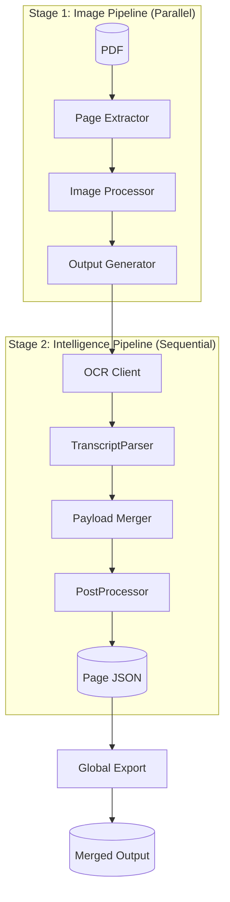
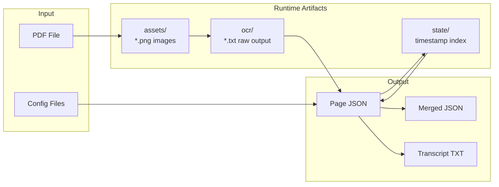
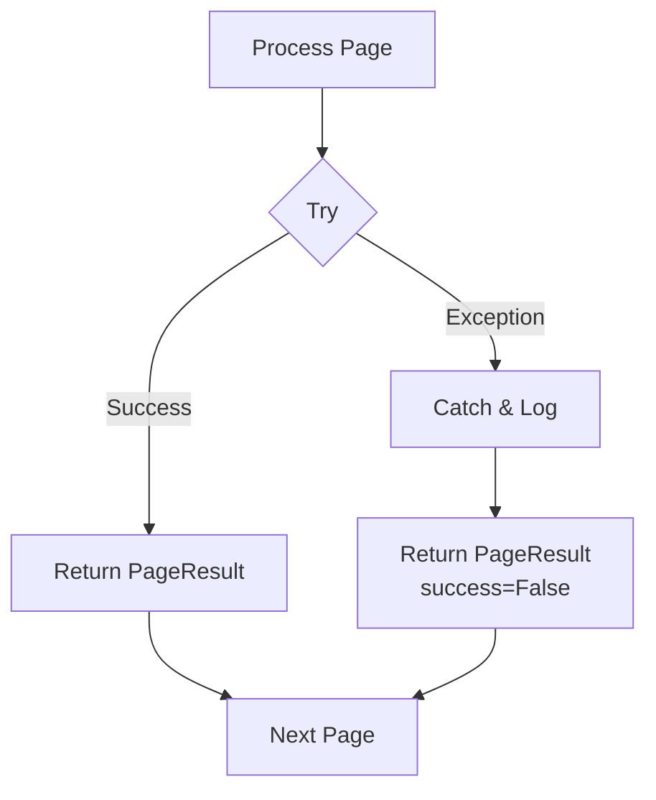
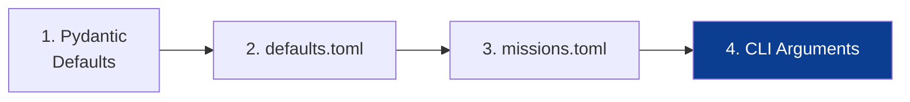

# Architecture

System design, data structures, and module organization.

## Table of Contents

- [System Overview](#system-overview)
- [Data Flow](#data-flow)
- [Data Structures](#data-structures)
- [Module Organization](#module-organization)
- [Output Structure](#output-structure)
- [Error Handling](#error-handling)
- [Configuration Hierarchy](#configuration-hierarchy)

---

## System Overview

The pipeline is built on a **two-stage architecture** optimized for different processing characteristics:

| Stage | Mode | Optimized For | Orchestrator |
|:------|:-----|:--------------|:-------------|
| **1. Image Pipeline** | Parallel | Throughput (CPU-bound) | `src/core/pipeline.py` |
| **2. Intelligence Pipeline** | Sequential | Accuracy (Context-dependent) | `main.py` |



---

## Data Flow

### Artifact Generation



---

## Data Structures

### PageResult (Internal)

Passed between the Image Pipeline and the main CLI orchestrator:

```python
@dataclass
class PageResult:
    page_num: int
    processing: ProcessingResult | None  # Image stats (skew angle, etc.)
    output: PageOutput | None            # Paths to generated files
    success: bool
    error: str | None

    # Timing metrics
    extract_s: float | None
    process_s: float | None
    output_s: float | None
```

### Page JSON Schema

Output structure written to `output/<stem>/pages/Page_NNN/Page_NNN.json`:

```json
{
  "header": {
    "page": 42,
    "tape": "1/2",
    "is_apollo_title": false,
    "page_type": null
  },
  "blocks": [
    {
      "type": "comm",
      "timestamp": "04 12 33 51",
      "speaker": "CDR",
      "location": "TRANQ",
      "text": "Houston, Tranquility Base here. The Eagle has landed."
    },
    {
      "type": "continuation",
      "text": "Roger, Tranquility.",
      "continuation_from_prev": false
    },
    {
      "type": "meta",
      "meta_type": "end_of_tape",
      "text": "END OF TAPE"
    }
  ]
}
```

### Block Types

| Type | Description | Key Fields |
|:-----|:------------|:-----------|
| `comm` | Communication block | `timestamp`, `speaker`, `location`, `text` |
| `continuation` | Text continuing previous block | `text`, `continuation_from_prev` |
| `meta` | Metadata markers | `meta_type`, `text` |
| `header` | Page header content | `text` |
| `footer` | Page footer content | `text` |

### Meta Types

| meta_type | Trigger Pattern |
|:----------|:----------------|
| `rest_period` | "REST PERIOD - NO COMMUNICATIONS" |
| `transcript_header` | "AIR-TO-GROUND VOICE TRANSCRIPTION" |
| `lunar_rev` | "BEGIN/END LUNAR REV N" |
| `end_of_tape` | "END OF TAPE" |

---

## Module Organization

```mermaid
flowchart TB
    subgraph Core ["Core"]
        MAIN[main.py<br/><small>Stage 2 Orchestration</small>]
        PIPE[src/core/pipeline.py<br/><small>Stage 1 Orchestration</small>]
        POSTPROC[src/core/post_processing.py<br/><small>PostProcessor</small>]
    end

    subgraph Config ["Config (src/config/)"]
        MODELS[models.py<br/><small>Pydantic schemas</small>]
        GCFG[global_config.py<br/><small>Loader</small>]
    end

    subgraph Processors ["Processors (src/processors/)"]
        EXTM[page_extractor.py<br/><small>PDF rendering</small>]
        IMGM[image_processor.py<br/><small>OpenCV transforms</small>]
    end

    subgraph OCRMod ["OCR (src/ocr/)"]
        CLIENT[ocr_client.py<br/><small>LM Studio API</small>]
        PARSER[parsing/parser.py<br/><small>TranscriptParser class</small>]
        CLEAN[parsing/cleaning.py<br/><small>Regex utils</small>]
        MERGE[parsing/merger.py<br/><small>Payload merger</small>]
    end

    subgraph Correctors ["Correctors (src/correctors/)"]
        TSC[timestamp_corrector.py]
        TXC[text_corrector.py]
        SPC[speaker_corrector.py]
        LOC[location_corrector.py]
        TSI[timestamp_index.py]
    end

    subgraph Utils ["Utils (src/utils/)"]
        OUTG[output_generator.py<br/><small>File I/O</small>]
        MERG[merge_export.py<br/><small>Global export</small>]
        MHELP[merge_helpers.py<br/><small>Timestamp/text utils</small>]
        BHELP[block_helpers.py<br/><small>Block filtering</small>]
        CONS[console.py<br/><small>Rich UI</small>]
    end

    MAIN --> PIPE
    PIPE --> EXTM
    PIPE --> IMGM
    PIPE --> OUTG
    
    MAIN --> CLIENT
    MAIN --> PARSER
    MAIN --> POSTPROC
    PARSER --> CLEAN
    POSTPROC --> CLEAN
    POSTPROC --> TSC
    POSTPROC --> TXC
    POSTPROC --> SPC
    POSTPROC --> LOC
```



### Module Responsibilities

| Module | Responsibility |
|:-------|:---------------|
| `main.py` | CLI entry point, intelligence stage orchestration, tape sequence validation. |
| `src/core/pipeline.py` | Image pipeline orchestration and parallel task management. |
| `src/core/post_processing.py` | Centralized correction pipeline (`PostProcessor`). |
| `src/config/models.py` | Pydantic configuration schemas and validation. |
| `src/processors/page_extractor.py` | Thread-safe PDF rendering via PyMuPDF. |
| `src/processors/image_processor.py` | Image geometry and contrast enhancement. |
| `src/ocr/ocr_client.py` | API communication with local vision model server. |
| `src/ocr/parsing/parser.py` | State machine class for initial structure identification. |
| `src/ocr/parsing/cleaning.py` | Atomic regex-based text and structure cleaning. |
| `src/ocr/parsing/merger.py` | Logic for combining multiple OCR passes into one payload. |
| `src/correctors/` | Specialized logic for timestamps, speakers, locations, and spell-checking. |
| `src/utils/output_generator.py` | Standardized directory and asset management. |
| `src/utils/merge_export.py` | Global aggregation and rendering (JSON, Text, MD). |
| `src/utils/merge_helpers.py` | Reusable utilities for timestamp/text manipulation. |
| `src/utils/block_helpers.py` | Filtering and iteration helpers for block collections. |
| `src/utils/console.py` | Rich terminal UI for progress tracking and metrics. |
| `src/constants.py` | Global constants (speaker sets, thresholds, technical limits). |

---

## Output Structure

```
output/
└── AS11_TEC/
    ├── AS11_TEC_merged.json          # Global merged transcript
    └── pages/
        └── Page_001/
            ├── AS11_TEC_page_0001.json   # Structured page data
            ├── assets/
            │   ├── *_enhanced.png        # Sent to OCR
            │   ├── *_raw.png             # Unprocessed render
            │   └── *_faint.png           # High-contrast fallback
            └── ocr/
                ├── *_ocr_raw.txt         # Primary pass output
                ├── *_ocr_raw_fallback.txt
                ├── *_ocr_faint_fallback.txt
                └── *_ocr_textcol.txt     # Right-column pass

state/
└── AS11_TEC_timestamps_index.json    # Cross-page continuity
```

### File Purposes

| File | Purpose |
|:-----|:--------|
| `*_timestamps_index.json` | Enables timestamp correction across session restarts |
| `assets/*.png` | Visual debugging — compare enhanced vs raw if OCR fails |
| `ocr/*.txt` | Raw VLM output before parsing — useful for prompt tuning |

---

## Error Handling

### Image Stage (Parallel)

- Exceptions caught per-page in `pipeline.process_page`
- Failed pages return `PageResult(success=False, error="...")`
- Pipeline continues; failures reported in final summary

### Intelligence Stage (Sequential)

- Network errors logged with warning, failure counter incremented
- Parse errors caught, raw text dumped for debugging
- Processing continues to next page (best-effort)



---

## Configuration Hierarchy

Settings are validated via Pydantic and applied in priority order:



| Layer | Type | Scope |
|:------|:-----|:------|
| Pydantic Models | Code | Safe fallback values and schema definition |
| Global Settings | TOML | Cross-mission defaults |
| Mission Overrides | TOML | Per-PDF layout and corrector settings |
| CLI Arguments | Flag | Execution-specific overrides (e.g. `--ocr-url`) |
