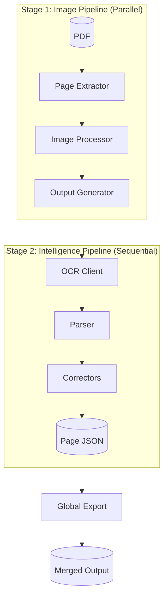
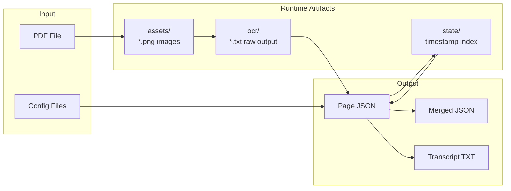
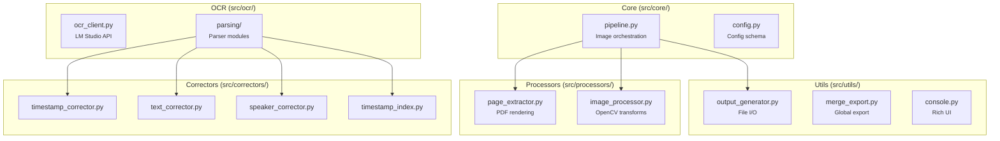
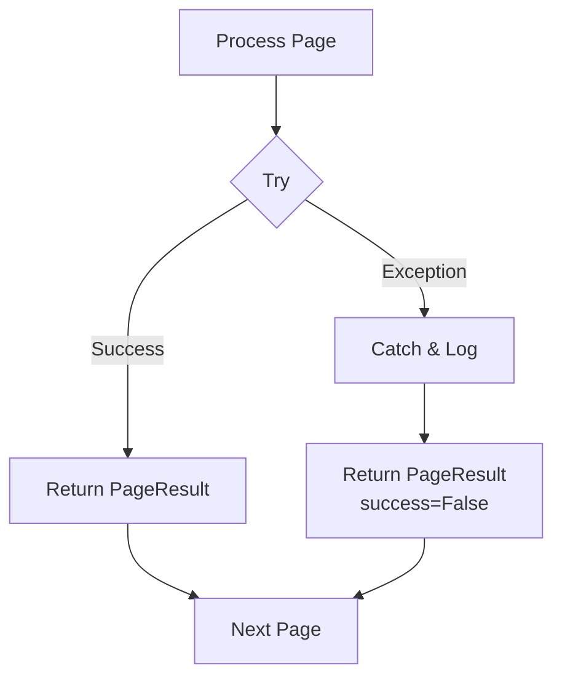
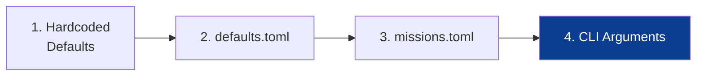

# Architecture

> System design, data structures, and module organization.

## Table of Contents

- [System Overview](#system-overview)
- [Data Flow](#data-flow)
- [Data Structures](#data-structures)
- [Module Organization](#module-organization)
- [Output Structure](#output-structure)
- [Error Handling](#error-handling)
- [Configuration Hierarchy](#configuration-hierarchy)

---

## System Overview

The pipeline is built on a **two-stage architecture** optimized for different processing characteristics:

| Stage | Mode | Optimized For |
|:------|:-----|:--------------|
| **Image Stage** | Parallel | Throughput (CPU-bound) |
| **Intelligence Stage** | Sequential | Accuracy (depends on prior pages) |


```mermaid
flowchart TB
    subgraph "Stage 1: Image Pipeline (Parallel)"
        direction LR
        PDF[(PDF)] --> EXT[Page Extractor]
        EXT --> IMG[Image Processor]
        IMG --> OUT[Output Generator]
    end

    subgraph "Stage 2: Intelligence Pipeline (Sequential)"
        direction LR
        OUT --> OCR[OCR Client]
        OCR --> PARSE[Parser]
        PARSE --> CORR[Correctors]
        CORR --> JSON[(Page JSON)]
    end

    JSON --> EXP[Global Export]
    EXP --> MERGED[(Merged Output)]
```

---

## Data Flow

### Artifact Generation


```mermaid
flowchart LR
    subgraph Input
        PDF[PDF File]
        CFG[Config Files]
    end

    subgraph "Runtime Artifacts"
        ASSETS["assets/<br/>*.png images"]
        OCRLOG["ocr/<br/>*.txt raw output"]
        IDX["state/<br/>timestamp index"]
    end

    subgraph Output
        PJSON[Page JSON]
        MJSON[Merged JSON]
        TXT[Transcript TXT]
    end

    PDF --> ASSETS
    CFG --> PJSON
    ASSETS --> OCRLOG
    OCRLOG --> PJSON
    PJSON --> IDX
    IDX --> PJSON
    PJSON --> MJSON
    PJSON --> TXT
```

---

## Data Structures

### PageResult (Internal)

Passed between the Image Pipeline and CLI orchestrator:

```python
@dataclass
class PageResult:
    page_num: int
    processing: ProcessingResult | None  # Image stats (skew angle, etc.)
    output: PageOutput | None            # Paths to generated files
    success: bool
    error: str | None

    # Timing metrics
    extract_s: float | None
    process_s: float | None
    output_s: float | None
```

### Page JSON Schema

Output structure written to `output/<stem>/pages/Page_NNN/Page_NNN.json`:

```json
{
  "header": {
    "page": 42,
    "tape": "1/2",
    "is_apollo_title": false,
    "page_type": null
  },
  "blocks": [
    {
      "type": "comm",
      "timestamp": "04 12 33 51",
      "speaker": "CDR",
      "location": "TRANQ",
      "text": "Houston, Tranquility Base here. The Eagle has landed."
    },
    {
      "type": "continuation",
      "text": "Roger, Tranquility.",
      "continuation_from_prev": false
    },
    {
      "type": "meta",
      "meta_type": "end_of_tape",
      "text": "END OF TAPE"
    }
  ]
}
```

### Block Types

| Type | Description | Key Fields |
|:-----|:------------|:-----------|
| `comm` | Communication block | `timestamp`, `speaker`, `location`, `text` |
| `continuation` | Text continuing previous block | `text`, `continuation_from_prev` |
| `meta` | Metadata markers | `meta_type`, `text` |
| `header` | Page header content | `text` |
| `footer` | Page footer content | `text` |

### Meta Types

| meta_type | Trigger Pattern |
|:----------|:----------------|
| `rest_period` | "REST PERIOD - NO COMMUNICATIONS" |
| `transcript_header` | "AIR-TO-GROUND VOICE TRANSCRIPTION" |
| `lunar_rev` | "BEGIN/END LUNAR REV N" |
| `end_of_tape` | "END OF TAPE" |

---

## Module Organization


```mermaid
flowchart TB
    subgraph Core ["Core (src/core/)"]
        PIPE[pipeline.py<br/><small>Image orchestration</small>]
        CONF[config.py<br/><small>Config schema</small>]
    end

    subgraph Processors ["Processors (src/processors/)"]
        EXTM[page_extractor.py<br/><small>PDF rendering</small>]
        IMGM[image_processor.py<br/><small>OpenCV transforms</small>]
    end

    subgraph OCRMod ["OCR (src/ocr/)"]
        CLIENT[ocr_client.py<br/><small>LM Studio API</small>]
        PARSER[parsing/<br/><small>Parser modules</small>]
    end

    subgraph Correctors ["Correctors (src/correctors/)"]
        TSC[timestamp_corrector.py]
        TXC[text_corrector.py]
        SPC[speaker_corrector.py]
        TSI[timestamp_index.py]
    end

    subgraph Utils ["Utils (src/utils/)"]
        OUTG[output_generator.py<br/><small>File I/O</small>]
        MERG[merge_export.py<br/><small>Global export</small>]
        CONS[console.py<br/><small>Rich UI</small>]
    end

    PIPE --> EXTM
    PIPE --> IMGM
    PIPE --> OUTG
    PARSER --> TSC
    PARSER --> TXC
    PARSER --> SPC
    PARSER --> TSI
```

### Module Responsibilities

| Module | Responsibility |
|:-------|:---------------|
| `pipeline.py` | ThreadPoolExecutor management, page iteration |
| `config.py` | PipelineConfig dataclass, validation |
| `page_extractor.py` | Thread-safe PDF rendering via PyMuPDF |
| `image_processor.py` | Deskew, normalization, enhancement (stateless) |
| `ocr_client.py` | HTTP requests to LM Studio, Base64 encoding |
| `parsing/patterns.py` | Regex patterns and constants |
| `parsing/preprocessor.py` | Line splitting, embedded component detection |
| `parsing/state_machine.py` | Line classification state machine |
| `parsing/block_builder.py` | JSON construction with corrections |
| `timestamp_corrector.py` | Monotonic time enforcement |
| `text_corrector.py` | Lexicon-based spelling correction |
| `speaker_corrector.py` | Callsign normalization |
| `timestamp_index.py` | Persistent cross-page timestamp storage |
| `output_generator.py` | Directory creation, atomic file writes |
| `merge_export.py` | JSON merge, TXT formatting |
| `console.py` | Progress bars, status tables |

---

## Output Structure

```
output/
└── AS11_TEC/
    ├── AS11_TEC_merged.json          # Global merged transcript
    ├── AS11_TEC_transcript.txt       # Formatted text output
    └── pages/
        └── Page_001/
            ├── AS11_TEC_page_0001.json   # Structured page data
            ├── assets/
            │   ├── *_enhanced.png        # Sent to OCR
            │   ├── *_raw.png             # Unprocessed render
            │   └── *_faint.png           # High-contrast fallback
            └── ocr/
                ├── *_ocr_raw.txt         # Primary pass output
                ├── *_ocr_raw_fallback.txt
                ├── *_ocr_faint_fallback.txt
                └── *_ocr_textcol.txt     # Right-column pass

state/
└── AS11_TEC_timestamps_index.json    # Cross-page continuity
```

### File Purposes

| File | Purpose |
|:-----|:--------|
| `*_timestamps_index.json` | Enables timestamp correction across session restarts |
| `assets/*.png` | Visual debugging — compare enhanced vs raw if OCR fails |
| `ocr/*.txt` | Raw VLM output before parsing — useful for prompt tuning |

---

## Error Handling

### Image Stage (Parallel)

- Exceptions caught per-page in `pipeline.process_page`
- Failed pages return `PageResult(success=False, error="...")`
- Pipeline continues; failures reported in final summary

### Intelligence Stage (Sequential)

- Network errors logged with warning, failure counter incremented
- Parse errors caught, raw text dumped for debugging
- Processing continues to next page (best-effort)


```mermaid
flowchart TD
    START[Process Page] --> TRY{Try}
    TRY -->|Success| OK[Return PageResult]
    TRY -->|Exception| CATCH[Catch & Log]
    CATCH --> FAIL[Return PageResult<br/>success=False]
    OK --> NEXT[Next Page]
    FAIL --> NEXT
```

---

## Configuration Hierarchy

Settings are applied in layers, with later layers overriding earlier ones:


```mermaid
flowchart LR
    A["1. Hardcoded<br/>Defaults"] --> B["2. defaults.toml"]
    B --> C["3. missions.toml"]
    C --> D["4. CLI Arguments"]

    style D fill:#0B3D91,color:#fff
```

| Layer | Location | Scope |
|:------|:---------|:------|
| Hardcoded | `PipelineConfig` class | Fallback values |
| Global | `config/defaults.toml` | All missions |
| Mission | `config/missions.toml` | Per-PDF overrides |
| CLI | Command-line flags | Single run |

---

## Project Structure

```
ocr_transcript_v2/
├── main.py                 # CLI entry point
├── config/
│   ├── defaults.toml       # Global settings
│   ├── missions.toml       # Mission overrides
│   └── prompts.toml        # OCR prompts
├── src/
│   ├── core/
│   │   ├── config.py
│   │   └── pipeline.py
│   ├── processors/
│   │   ├── page_extractor.py
│   │   └── image_processor.py
│   ├── ocr/
│   │   ├── ocr_client.py
│   │   ├── ocr_parser.py
│   │   └── parsing/
│   │       ├── patterns.py
│   │       ├── utils.py
│   │       ├── preprocessor.py
│   │       ├── state_machine.py
│   │       └── block_builder.py
│   ├── correctors/
│   │   ├── speaker_corrector.py
│   │   ├── text_corrector.py
│   │   ├── timestamp_corrector.py
│   │   └── timestamp_index.py
│   └── utils/
│       ├── console.py
│       ├── merge_export.py
│       └── output_generator.py
├── docs/
├── input/
├── output/
└── state/
```
