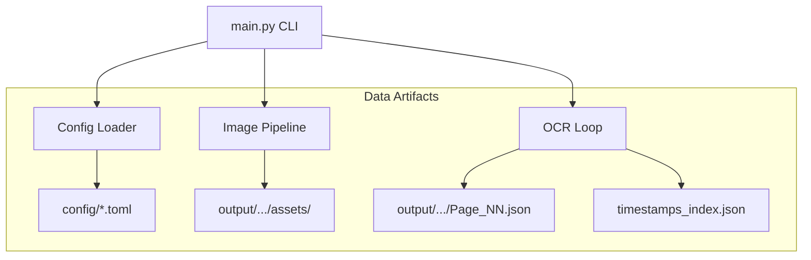

# Architecture Documentation

This document describes the high-level architecture, data structures, and module
responsibilities.

## System Overview

The application is built on a **Pipeline Pattern** separated into two distinct
stages to optimize for both throughput (Image Processing) and accuracy
(Intelligence).


```mermaid
flowchart TD
    CLI[main.py CLI] --> CFG[Config Loader]
    CLI --> IP[Image Pipeline]
    CLI --> OP[OCR Loop]

    subgraph "Data Artifacts"
    CFG --> TOML[config/*.toml]
    IP --> ASSETS[output/.../assets/]
    OP --> JSON[output/.../Page_NN.json]
    OP --> IDX[timestamps_index.json]
    end
```

## Data Structures

### 1. PageResult (Internal)

Used to pass state between the Image Pipeline and the CLI.

```python
@dataclass
class PageResult:
    page_num: int
    processing: ProcessingResult | None  # Image stats (skew angle, etc)
    output: PageOutput | None            # Paths to generated files
    success: bool                        # Status flag
    error: str | None                    # Error message
    # Performance Metrics
    extract_s: float | None
    process_s: float | None
    output_s: float | None
```

### 2. Output JSON Schema

The final structure written to `output/<mission>/Page_NNN/Page_NNN.json`.

```json
{
  "header": {
    "page": 42,              // Integer: Logical page number
    "tape": "1/2",           // String: Tape/Reel identifier (calculated)
    "is_apollo_title": true  // Boolean: Detected title page
  },
  "blocks": [
    {
      "type": "comm",        // Enum: "comm", "text", "meta", "header", "footer"
      "timestamp": "04 12 33 51",
      "speaker": "CDR",
      "location": "TRANQ",   // Optional: Station identifier
      "text": "Houston, Roger.",
      "timestamp_correction": "inferred_tens" // Optional: Debug flag
    },
    {
      "type": "continuation",
      "text": "We copy you down.",
      "continuation_from_prev": true // Merged from previous page
    }
  ]
}
```

## Output Directory Structure

The pipeline generates a structured output directory for each mission.

```text
output/
└── AS11_TEC/                       # Mission Stem Name
    ├── timestamps_index.json       # Global Index (Chronological continuity)
    ├── Page_001/                   # 1-based Page Directory
    │   ├── AS11_TEC_page_0001.json # FINAL structured transcript
    │   ├── assets/
    │   │   ├── *_raw.pdf           # Single page extracted from source
    │   │   └── *_enhanced.png      # Processed image sent to OCR
    │   └── ocr/
    │       ├── *_ocr_raw.txt       # Raw output from Primary OCR pass
    │       └── *_ocr_textcol.txt   # Raw output from Right-Column pass
    ├── Page_002/
    │   └── ...
    └── ...
```

### File Details

- **`timestamps_index.json`**:
  - **Role**: Critical for the sequential processing stage.
  - **Content**: A mapping of `{ page_num: [list_of_timestamps] }`.
  - **Usage**: Allows the parser to look back at previous pages (even across
    restart sessions) to correct "50->10" OCR errors and maintain monotonic
    time.

- **`assets/`**:
  - **Role**: Debugging and visual verification.
  - **Usage**: If OCR fails, check `*_enhanced.png` to see if the image
    processing (deskew, noise removal) degraded the text quality.

- **`ocr/`**:
  - **Role**: Transparency and prompt engineering.
  - **Usage**: Contains the raw, hallucinated string returned by the VLM
    before any parsing logic runs. Useful for tweaking prompts.

## Module Responsibilities

### Core (`src.core`)

- **`pipeline.py`**: Orchestrates the *Image Processing* stage. Manages the
  `ThreadPoolExecutor`.
- **`config.py`**: Defines `PipelineConfig` dataclass and validation logic.

### Processors (`src.processors`)

- **`page_extractor.py`**: Wraps `pymupdf`. Handles PDF locking and
  rasterization.
- **`image_processor.py`**: Wraps `opencv`. Pure functional image
  transformations (State: None).

### OCR (`src.ocr`)

- **`ocr_client.py`**: Wraps HTTP requests to LM Studio. Handles Base64
  encoding and payload structuring.
- **`ocr_parser.py`**: The "brain" of the text processing. Contains the State
  Machine for block parsing.

### Correctors (`src.correctors`)

- **`timestamp_corrector.py`**: Implements the monotonic time logic.
- **`text_corrector.py`**: Implements the Levenshtein/Gestalt scoring
  algorithm.
- **`timestamp_index.py`**: Manages the persistent JSON index for cross-page
  time continuity.

### Utils (`src.utils`)

- **`output_generator.py`**: Manages filesystem paths and atomic writes.
- **`console.py`**: Manages the Rich UI (Progress bars, Live tables).

## Error Handling Strategy

1. **Image Stage (Parallel)**:
   - Exceptions are caught per-page in `pipeline.process_page`.
   - Failed pages return `success=False` in `PageResult`.
   - The pipeline continues; failures are reported in the final summary.

2. **OCR Stage (Sequential)**:
   - Network errors (`OCRConnectionError`) log a warning and increment a
     failure counter.
   - Parsing errors (`ValueError`) are caught, logged, and the raw text is
     dumped for debugging.
   - The loop continues to the next page (best-effort).

## Configuration Hierarchy

Configuration is applied in layers, with later layers overriding earlier ones:

1. **Hardcoded Defaults**: In `PipelineConfig` class definition.
2. **Global Config**: `config/defaults.toml`.
3. **Mission Config**: `config/missions.toml` (Matches by filename).
4. **CLI Arguments**: Flags like `--no-ocr`, `--pages`.

## Project File Structure

```text
ocr_transcript_v2/
├── main.py                     # Entry point (CLI & Intelligence Orchestrator)
├── config/
│   ├── defaults.toml           # Global settings
│   ├── missions.toml           # Mission-specific overrides
│   └── prompts.toml            # OCR & Classification prompts
├── src/
│   ├── core/
│   │   ├── config.py           # Config schema
│   │   └── pipeline.py         # Image Pipeline Orchestrator
│   ├── processors/
│   │   ├── page_extractor.py   # PDF Rendering
│   │   └── image_processor.py  # OpenCV enhancements
│   ├── ocr/
│   │   ├── ocr_client.py       # LM Studio Client
│   │   └── ocr_parser.py       # Text Parsing Engine
│   ├── correctors/
│   │   ├── speaker_corrector.py
│   │   ├── text_corrector.py
│   │   ├── timestamp_corrector.py
│   │   └── timestamp_index.py
│   └── utils/
│       ├── output_generator.py # File I/O
│       └── console.py          # Terminal UI
├── docs/                       # Project Documentation
├── input/                      # Input PDFs
└── output/                     # Generated Artifacts
```
