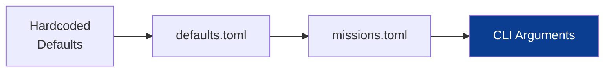

# Configuration Reference

Complete reference for all configuration options.

## Table of Contents

- [Overview](#overview)
- [Configuration Hierarchy](#configuration-hierarchy)
- [Global Defaults](#global-defaults-configdefaultstoml)
- [Mission Overrides](#mission-overrides-configmissionstoml)
- [OCR Prompts](#ocr-prompts-configpromptstoml)
- [CLI Arguments](#cli-arguments)

---

## Overview

The pipeline uses a layered configuration system. Settings are applied in order, with later layers overriding earlier ones:



---

## Configuration Hierarchy

| Priority | Source | Scope |
|:---------|:-------|:------|
| 1 (lowest) | Pydantic Models | Built-in fallback values in code |
| 2 | `config/defaults.toml` | All missions |
| 3 | `config/missions.toml` | Per-PDF overrides |
| 4 (highest) | CLI arguments | Single run |

---

## Global Defaults (`config/defaults.toml`)

### I/O Settings

| Key | Type | Default | Description |
|:----|:-----|:--------|:------------|
| `input_dir` | string | `"input"` | Source PDF directory |
| `output_dir` | string | `"output"` | Output base directory |
| `state_dir` | string | `"state"` | Persistent state (timestamp index) |

### OCR Settings

| Key | Type | Default | Description |
|:----|:-----|:--------|:------------|
| `ocr_url` | string | `"http://localhost:1234"` | LM Studio server URL |
| `ocr_model` | string | `"qwen/qwen3-vl-4b"` | Vision model identifier |
| `ocr_prompt` | string | `"plain"` | Prompt mode: `"plain"` or `"column"` |
| `ocr_timeout` | int | `120` | Request timeout in seconds |
| `ocr_max_tokens` | int | `4096` | Maximum response tokens |

### Multi-pass OCR

| Key | Type | Default | Description |
|:----|:-----|:--------|:------------|
| `ocr_dual_pass` | bool | `true` | Enable raw image fallback pass |
| `ocr_faint_pass` | bool | `true` | Enable high-contrast fallback pass |
| `ocr_text_column_pass` | bool | `true` | Enable right-column fill pass |

### Processing Settings

| Key | Type | Default | Description |
|:----|:-----|:--------|:------------|
| `dpi` | int | `300` | PDF rendering resolution |
| `parallel` | bool | `true` | Enable parallel image processing |
| `workers` | int | `4` | Thread pool size |
| `timing` | bool | `true` | Show per-page timing |

### Image Enhancement

| Key | Type | Default | Description |
|:----|:-----|:--------|:------------|
| `deskew_angle_threshold` | float | `0.1` | Minimum angle (degrees) to trigger rotation |
| `clahe_clip_limit` | float | `2.0` | CLAHE contrast limit |
| `clahe_grid_size` | int | `8` | CLAHE grid size |
| `bilateral_d` | int | `9` | Bilateral filter diameter |
| `unsharp_amount` | float | `1.5` | Unsharp mask strength |

### Layout Detection

| Key | Type | Default | Description |
|:----|:-----|:--------|:------------|
| `col2_end` | float | `0.30` | Speaker column end ratio (0-1) |
| `min_block_area` | int | `1000` | Minimum block area to consider |
| `max_block_area_ratio` | float | `0.9` | Maximum block area as ratio of page |

### Lexicon Settings

```toml
[pipeline_defaults.lexicon]
mission_keywords = [
    "CARNARVON", "TANANARIVE", "GUAM", "MADRID", "ASCENSION",
    "BERMUDA", "CANARY", "HONOLULU", "GOLDSTONE", "MILA",
    "TEI", "TLI", "LOI", "COI", "EVA", "LM", "CSM", "CMC", "LGC", "DSKY",
    # Technical terms with hyphens (preserve exact format for OCR correction)
    "S-IVB", "S-IV", "AIR-TO-GROUND", "NO-GO",
    "DELTA-P", "DELTA-V", "DELTA-VC", "DELTA-H", "DELTA-VZ",
    "DELTA-VT", "DELTA-TIG", "DELTA-R", "DELTA-VX", "LOI-2",
    ...
]
```

Protected keywords that won't be spell-corrected. Includes:
- **Station names**: CARNARVON, GUAM, MADRID, etc.
- **Mission events**: TEI, TLI, LOI (Trans-Earth Injection, etc.)
- **Hardware**: LM, CSM, DSKY (Lunar Module, Command Module, Display & Keyboard)
- **Hyphenated technical terms**: S-IVB, DELTA-V, etc. (preserves exact format)

### Corrector Settings

```toml
[pipeline_defaults.correctors.speaker_ocr_fixes]
"CT" = "CMP"
"CTP" = "CMP"
"CMF" = "CMP"
"CMFVERB" = "CMP"
"IMF" = "LMP"
"CDF" = "CDR"

[pipeline_defaults.correctors.invalid_location_annotations]
annotations = [
    "LAUGHING", "LAUGHTER", "LAUGH",
    "GARBLE", "GARBLED",
    "PAUSE", "PAUSED",
]
```

**Speaker OCR Fixes**: Common OCR misreads of speaker callsigns (e.g., "CT" -> "CMP").

**Invalid Location Annotations**: Terms that appear in the location field but are actually annotations (laughter, garble, etc.). These will be filtered out by the LocationCorrector.

### Parser Settings

```toml
[pipeline_defaults.parser.text_replacements]
"\\bRFV\\b" = "REV"
"\\bRE V\\b" = "REV"
```

Global regex replacements applied to OCR text **after** spell-checking.

**IMPORTANT**: Replacements are applied AFTER spell-checking to prevent re-correction. For example, "Is-IVB" -> "S-IVB" must happen after spell-check completes.

---

## Mission Overrides (`config/missions.toml`)

Per-mission settings that override global defaults.

### Structure

```toml
[mission.<id>]
file_name = "AS11_TEC.PDF"
page_offset = -2
# ... additional overrides
```

### Available Overrides

| Key | Type | Description |
|:----|:-----|:------------|
| `file_name` | string | PDF filename (required) |
| `page_offset` | int | Offset between PDF page and transcript page number |
| `col2_end` | float | Speaker column end ratio |
| `valid_speakers` | list | Allowed speaker callsigns for correction |
| `valid_locations` | list | Allowed location identifiers |
| `text_replacements` | table | Mission-specific OCR fixes (regex patterns) |
| `speaker_ocr_fixes` | table | Mission-specific speaker OCR corrections |
| `manual_speaker_corrections` | table | Manual speaker fixes by exact timestamp |

### Example: Apollo 11

```toml
[mission.11]
file_name = "AS11_TEC.PDF"
page_offset = -2
col2_end = 0.30

valid_speakers = [
    "CDR", "CC", "CMP", "LMP", "SC", "HOUSTON", "MS", "MSFN",
    "PAO", "CT", "HORNET", "MCC", "COMM", "SWIM 1", "PRESIDENT NIXON"
]

valid_locations = ["EAGLE", "COLUMBIA", "TRANQ", "EVA"]

# Regex text replacements (applied AFTER spell-checking)
text_replacements = {
    "\\bll\\b" = "11",
    "\\bI1\\b" = "11",
    "\\bil\\b" = "11",
    "(\\w+)'11" = "\\1'll",
    "GRAINED BEAM" = "GRAND BAHAMA",
    "Gunymas" = "Guaymas",
    "PFESS" = "PRESS",
    "PASS light" = "PRESS light",
    "MASTEP" = "MASTER",
    "CDY" = "CDR",
    "LIF" = "LMP",
    "HIM" = "LMP",
    "\\b(His|Is)-IV" = "S-IV",
}

# Mission-specific speaker OCR fixes
[mission.11.speaker_ocr_fixes]
"TLI" = "CC"
"Tli" = "CC"

# Manual corrections for specific timestamps
[mission.11.manual_speaker_corrections]
"00 05 41 36" = "CMP"  # "(V'" OCR error
```

---

## OCR Prompts (`config/prompts.toml`)

Customize VLM instructions without code changes.

### Available Prompts

#### `plain_ocr_prompt`

Used when `ocr_prompt = "plain"` (default).

```text
You are a precise OCR engine. Extract all visible text from the page image.
Preserve reading order top-to-bottom, left-to-right, keeping original line breaks.
Each transcript line spans multiple columns (timestamp, speaker, text).
Read the full line across the page.
Do not stop at the speaker column; include the rightmost text for each line.
You may apply minimal corrections to obvious OCR artifacts
(e.g., G() -> GO, O/0, I/1) but only when highly confident.
Ensure sentences read sensibly without inventing or adding any words.
Do NOT hallucinate or guess missing content.
Output plain text only with original line breaks.
Do not add any conversational text or formatting outside the original content.
```

#### `column_ocr_prompt`

Used when `ocr_prompt = "column"`.

```text
You are a precise OCR engine for NASA mission transcripts.
Each line is laid out as columns: timestamp (left), speaker (middle), text (right).
Read full lines across the page, do not stop at column boundaries.
Preserve reading order top-to-bottom, left-to-right, keeping original line breaks.
Output plain text only with original line breaks.
Do not add any conversational text or formatting outside the original content.
```

#### `text_column_prompt`

Used during the right-column OCR fill pass.

```text
You are a precise OCR engine.
The image is a cropped right-side text column of a transcript page.
Extract ONLY the visible text in that column.
Return one line per transcript line, preserving order top-to-bottom.
Do not add timestamps or speakers.
Output plain text only with original line breaks.
```

---

## CLI Arguments

### `process` Command

```bash
python main.py process <PDF_NAME> [OPTIONS]
```

| Argument | Type | Description |
|:---------|:-----|:------------|
| `PDF_NAME` | string | PDF filename in `input/` directory |

| Option | Type | Default | Description |
|:-------|:-----|:--------|:------------|
| `-p, --pages` | string | all | Page range (e.g., `"1-50"`, `"10,12,14-16"`) |
| `--clean` | flag | false | Delete previous output before running |
| `--no-ocr` | flag | false | Skip OCR stage (image processing only) |
| `--ocr-url` | string | from config | Override LM Studio URL |
| `--ocr-prompt` | choice | from config | `"plain"` or `"column"` |
| `--timing` | flag | from config | Show per-page timing breakdowns |
| `--no-timing` | flag | - | Disable timing display |
| `-v, --verbose` | flag | false | Verbose logging to `pipeline.log` |

### `export` Command

```bash
python main.py export <PDF_NAME>
```

Regenerates merged JSON and TXT from existing per-page data.

### `info` Command

```bash
python main.py info <PDF_NAME>
```

Displays PDF metadata and page count.

---

## Configuration Examples

### Minimal Setup

```toml
# config/defaults.toml
ocr_url = "http://localhost:1234"
```

### High-Quality Processing

```toml
# config/defaults.toml
dpi = 400
ocr_max_tokens = 8192
ocr_dual_pass = true
ocr_faint_pass = true
ocr_text_column_pass = true
workers = 8
```

### Remote OCR Server

```bash
python main.py process AS11_TEC.PDF --ocr-url http://192.168.1.100:1234
```

### Image Processing Only (Debug)

```bash
python main.py process AS11_TEC.PDF --no-ocr --pages 1-10
```