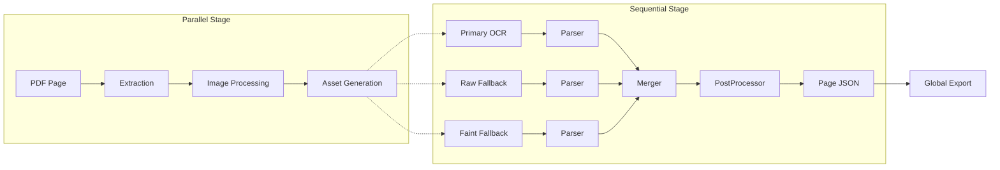
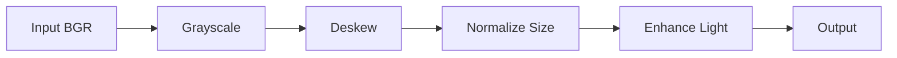
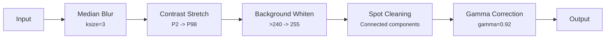
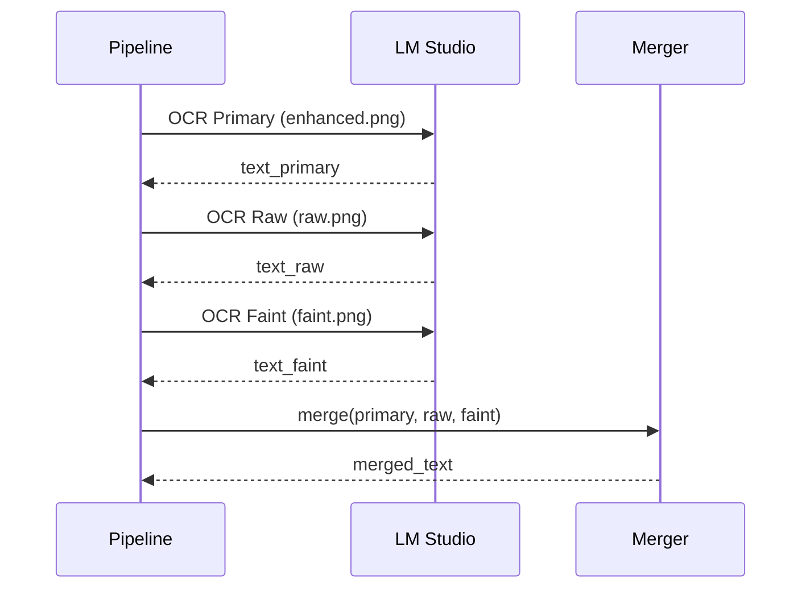

# Pipeline Stages

Technical deep-dive into image processing and OCR strategy.

## Table of Contents

- [Overview](#overview)
- [Stage 1: Page Extraction](#stage-1-page-extraction)
- [Stage 2: Image Processing](#stage-2-image-processing)
- [Stage 3: Output Generation](#stage-3-output-generation)
- [Stage 4: OCR Strategy](#stage-4-ocr-strategy)
- [Stage 5: Right-Column Fill](#stage-5-right-column-fill)
- [Stage 6: Global Export](#stage-6-global-export)

---

## Overview



---

## Stage 1: Page Extraction

**Module:** `src/processors/page_extractor.py`

Extracts raster images from the source PDF using PyMuPDF.

### Process

| Step | Operation | Notes |
|:-----|:----------|:------|
| 1 | **Lock** | `threading.Lock()` for thread safety |
| 2 | **Render** | `page.get_pixmap(dpi=300)` |
| 3 | **Convert** | Pixmap buffer to NumPy array (H x W x 3) |
| 4 | **Color space** | RGB to BGR (OpenCV format) |

### Thread Safety

MuPDF is not inherently thread-safe for parallel rendering. The extractor uses a lock to serialize access to the `pymupdf.Document` object while still allowing parallel processing of the extracted images.

---

## Stage 2: Image Processing

**Module:** `src/processors/image_processor.py`

A deterministic pipeline of geometric and photometric transformations.

### Pipeline Flow



### 2.1 Deskew Algorithm

Detects and corrects page rotation to ensure horizontal text lines.

| Step | Operation | Parameters |
|:-----|:----------|:-----------|
| 1 | Binarize | Otsu's threshold (`THRESH_BINARY_INV + THRESH_OTSU`) |
| 2 | Line fusion | Morphological dilate (50x1 kernel) |
| 3 | Contour detection | External contours only |
| 4 | Filter | Area > 500px, Aspect ratio > 5 |
| 5 | Angle calculation | `cv2.minAreaRect()`, normalized to [-45, +45] degrees |
| 6 | Voting | Median of all detected line angles |
| 7 | Fallback | Hough lines on Canny edges (if < 5 text lines) |
| 8 | Correction | `cv2.warpAffine` with `INTER_LANCZOS4` |

**Threshold:** Rotation only applied if `|angle| > 0.1` degrees.

### 2.2 Size Normalization

Standardizes the canvas for consistent OCR input.

| Parameter | Value |
|:----------|:------|
| Target size | 2550 x 3300 px (Letter @ 300 DPI) |
| Margins | 75 px uniform |
| Downscale | `INTER_AREA` |
| Upscale | `INTER_LANCZOS4` |

**Process:**
1. Detect content bounds (`threshold` + `boundingRect`)
2. Calculate scale factor: `min(target_w/bbox_w, target_h/bbox_h)`
3. Center resized content on white canvas

### 2.3 Photometric Enhancement

Conservative enhancement chain that cleans noise without degrading text.



#### Spot Cleaning Logic

Uses `cv2.connectedComponentsWithStats` to identify and remove noise:

| Condition | Action |
|:----------|:-------|
| Area <= 15 px | Remove (tiny speckles) |
| Area <= 50 px AND aspect ratio < 2 | Remove (square-ish dots) |

#### Gamma Correction

Applies a Look-Up Table with gamma=0.92:
- Slightly darkens mid-tones (text)
- Increases local contrast against white background

---

## Stage 3: Output Generation

**Module:** `src/utils/output_generator.py`

### Generated Assets

| File | Format | Purpose |
|:-----|:-------|:--------|
| `*_enhanced.png` | PNG (compression=6) | Sent to OCR |
| `*_raw.png` | PNG | Debug: unprocessed render |
| `*_faint.png` | PNG | Fallback: high-contrast render |

---

## Stage 4: OCR Strategy

**Module:** `src/ocr/ocr_client.py`

Uses Vision-Language Model (VLM) via LM Studio instead of traditional Tesseract.

### Payload Optimization

| Parameter | Value | Rationale |
|:----------|:------|:----------|
| Format | JPEG | Faster transmission |
| Quality | 95 | Preserves faint punctuation |
| Encoding | Base64 | OpenAI-compatible API |

### Prompt Modes

| Mode | Use Case | Key Instruction |
|:-----|:---------|:----------------|
| `plain` | Default full-page OCR | "Read left-to-right, preserve line breaks" |
| `column` | Column-aware extraction | "Each line has timestamp, speaker, text columns" |

### Multi-pass OCR

When enabled, additional passes improve accuracy:



| Pass | Source Image | Purpose |
|:-----|:-------------|:--------|
| Primary | `*_enhanced.png` | Main OCR with preprocessing |
| Raw | `*_raw.png` | Recover lines degraded by preprocessing |
| Faint | `*_faint.png` | Recover faded text anywhere on page |

### Merge Behavior

- If fallback line shares same timestamp/speaker: **replace** low-quality primary text
- If primary text is short but valid and fallback is longer/different: **insert as continuation**

---

## Stage 5: Right-Column Fill

**Module:** `src/ocr/ocr_client.py`

Optional localized OCR pass for missing dialogue.

### Trigger

`ocr_text_column_pass = true` in configuration

### Process

| Step | Operation |
|:-----|:----------|
| 1 | Identify `comm` blocks with empty `text` |
| 2 | Crop region: `x: [width * col2_end -> width]` |
| 3 | OCR with `text_column_prompt` |
| 4 | Filter out speaker/header patterns |
| 5 | Zip remaining lines into empty blocks |

**Note:** This uses a **static crop** based on `col2_end` (default: 0.30). No dynamic column detection.

### Smart Stitching

If a continuation starts with lowercase or punctuation, it's merged into the previous block to reform sentence structure.

---

## Stage 6: Global Export

At the end of processing, the pipeline generates merged outputs.

### Output Files

| File | Content |
|:-----|:--------|
| `<stem>_merged.json` | All pages combined in one JSON (keys like `Page 001`) |

### Manual Export

```bash
python main.py export <PDF_NAME>
```

Regenerates merged files from existing per-page JSON without re-running OCR.

---

## Fast Iteration Workflows

### Reparse from Stored OCR (Fast: 1-2 minutes)

After making configuration changes or code fixes, you can reparse from the cached OCR text instead of re-running the full OCR pipeline (which takes 3+ hours).

**Command:**

```bash
python main.py reparse <PDF_NAME>
```

**What it does:**

1. Reads stored OCR text from `output/<stem>/pages/Page_NNN/ocr/*.txt`
2. Re-runs the `TranscriptParser` class with current configuration
3. Re-runs the `PostProcessor` pipeline (all structural and logical fixes)
4. Regenerates per-page JSON files
5. Updates global timestamp index

**Use cases:**

- Fixed text_replacements regex patterns
- Added manual_speaker_corrections
- Updated valid_speakers or valid_locations
- Changed corrector logic
- Improved parser algorithms

### Post-Process Only (Fastest: 30 seconds)

If you only changed block-level processing (not parsing), you can run post-processing alone:

**Command:**

```bash
python main.py postprocess <PDF_NAME>
```

**What it does:**

1. Reads existing per-page JSON files
2. Re-runs block processing:
   - `split_embedded_timestamp_blocks()`
   - `merge_duplicate_comm_timestamps()`
   - `merge_nearby_duplicate_timestamps()`
   - `clean_or_merge_continuations()`
   - `merge_inline_annotations()`
3. Regenerates per-page JSON files

**Use cases:**

- Changed block merging logic
- Updated continuation detection
- Modified annotation handling

---

## Pipeline Comparison

| Operation | Duration | Use Case |
|:----------|:---------|:---------|
| `process` | 3-4 hours | Initial run, or after changing image processing/OCR |
| `reparse` | 1-2 minutes | After config changes, parser fixes, corrector updates |
| `postprocess` | 30 seconds | After block processing logic changes |
| `export` | 5 seconds | After metadata changes or formatting updates |
