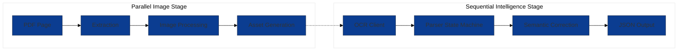

# Pipeline Documentation

This document provides a technical deep-dive into the processing stages.

## Overview

<!-- markdownlint-disable MD013 -->

```mermaid
%%{init: {'theme': 'base', 'themeVariables': { 'primaryColor': '#0B3D91', 'secondaryColor': '#8BA1B4', 'tertiaryColor': '#fff' }}}%%
flowchart LR
    subgraph "Parallel Image Stage"
    RAW[PDF Page] --> EXT[Extraction]
    EXT --> IMG[Image Processing]
    IMG --> OUT[Asset Generation]
    end

    subgraph "Sequential Intelligence Stage"
    OUT -.-> OCR[OCR Client]
    OCR --> PARSE[Parser State Machine]
    PARSE --> CORR[Semantic Correction]
    CORR --> JSON[JSON Output]
    end
```
<!-- markdownlint-enable MD013 -->

---

## Stage 1: Page Extraction

**Module**: `src.processors.page_extractor`

**Class**: `PageExtractor`

Thread-safe extraction of raster images from the source PDF.

1. **Locking**: Uses `threading.Lock()` to serialize access to the
   `pymupdf.Document` object (MuPDF is not inherently thread-safe for
   parallel rendering).
2. **Rendering**: Calls `page.get_pixmap(dpi=300)`.
3. **Conversion**: Converts the `pixmap` buffer to a `numpy` array
   (Height × Width × 3).
4. **Color Space**: Converts RGB to BGR (standard OpenCV format).

---

## Stage 2: Image Processing

**Module**: `src.processors.image_processor`

**Class**: `ImageProcessor`

A deterministic pipeline of geometric and photometric transformations.

### 2.1 Pre-processing

- **Grayscale**: `cv2.cvtColor(img, cv2.COLOR_BGR2GRAY)`.
- **Inversion** (Internal): Many subsequent steps use an inverted binary map
  (text = white, background = black).

### 2.2 Deskew Algorithm

Detects and corrects page rotation (skew) to ensure horizontal text lines.

1. **Binarization**: Otsu's thresholding (`THRESH_BINARY_INV + THRESH_OTSU`)
   to create a text mask.
2. **Line Fusion**: Applies a **50x1 Morphological Dilate**. This fuses
   individual characters into solid "line blobs".
3. **Contour Detection**: Finds external contours of these blobs.
4. **Filtering**: Keeps contours where:
   - `Area > 500 px`
   - `Aspect Ratio > 5` (elongated shapes only)
5. **Angle Calculation**: Uses `cv2.minAreaRect()` on valid contours.
   Normalizes angles to range `[-45, 45]`.
6. **Voting**: Calculates the `median` of all detected line angles.
7. **Fallback**: If < 5 text lines are found, runs `cv2.HoughLinesP` on
   Canny edges.
8. **Correction**:
   - **Threshold**: Rotates only if `abs(angle) > 0.1` degrees.
   - **Transformation**: `cv2.warpAffine` using `INTER_LANCZOS4`
     interpolation (preserves sharpness).

### 2.3 Size Normalization

Standardizes the canvas to facilitate consistent OCR.

1. **Content Detection**: `cv2.threshold(img, 240, 255, THRESH_BINARY_INV)`
   to find all non-white pixels.
2. **Bounding Box**: `cv2.boundingRect()` around all content.
3. **Scaling**:
   - Target: Letter Size (8.5" x 11") @ 300 DPI = **2550 x 3300 px**.
   - Margins: **75 px** uniform.
   - Calculates `scale = min(target_w/bbox_w, target_h/bbox_h)`.
4. **Resampling**:
   - Downscaling: `INTER_AREA` (resampling using pixel area relation).
   - Upscaling: `INTER_LANCZOS4`.
5. **Centering**: Places the resized content block in the center of a pure
   white (255) 2550x3300 canvas.

### 2.4 Photometric Enhancement (`_enhance_light`)

A conservative enhancement chain designed to clean background noise without
thinning text strokes.

1. **Denoising**: `cv2.medianBlur(ksize=3)`. Effective against
   salt-and-pepper scan noise.
2. **Contrast Stretching**:
   - Calculates **Black Point** ($P_2$) and **White Point** ($P_{98}$)
     percentiles.
   - Linear stretch: $Pixel' = (Pixel - P_2) \times \frac{255}{P_{98} - P_2}$
   - Clips values to [0, 255].
3. **Background Whitening**: Forces all pixels $> 240$ to $255$. This removes
   faint paper texture.
4. **Spot Cleaning**:
   - Uses `cv2.connectedComponentsWithStats`.
   - Iterates through all connected black components.
   - **Removal Criteria**:
     - `Area <= 15 px` (tiny speckles).
     - `Area <= 50 px` AND `Aspect Ratio < 2` (small square-ish dots,
       likely dust).
   - Replacement: Fills identified noise masks with White (255).
5. **Gamma Correction**: Applies a Look-Up Table (LUT) with $\gamma=0.92$.
   - Effect: Slightly darkens mid-tones (text), increasing local contrast
     against the white background.

---

## Stage 3: Output Generation

**Module**: `src.utils.output_generator`

1. **Asset Storage**: Creates `output/<stem>/Page_NNN/assets/`.
2. **Image Write**: Saves the processed image as PNG.
   - Uses `cv2.IMWRITE_PNG_COMPRESSION = 6` (Balance of speed/size).
   - Filename: `*_enhanced.png`.
3. **OCR Debug Assets** (optional):
   - `*_raw.png`: direct render from the source PDF (no enhancement).
   - `*_faint.png`: high-contrast fallback render for faint text recovery.

---

## Stage 4: OCR Strategy

**Module**: `src.ocr.ocr_client`

The pipeline uses a Vision-Language Model (VLM) approach rather than
traditional Tesseract LSTM.

### 4.1 Payload Optimization

To minimize latency and token costs while maintaining accuracy:

- **Format**: JPEG.
- **Quality**: 95 (High quality to preserve faint punctuation).
- **Base64**: Standard encoding for the OpenAI-compatible API.

### 4.2 Prompting Strategy

Two distinct prompts are used based on the task:

1. **Plain Mode (`PLAIN_OCR_PROMPT`)**:
   - Instructs the model to read left-to-right, ignoring column gaps.
   - Explicitly forbids "hallucinating" conversational fillers.
   - Output: Raw text with physical line breaks preserved.

2. **Column Mode (`TEXT_COLUMN_OCR_PROMPT`)**:
   - Used for the **Right-Column Fill** pass.
   - Input: A crop of the rightmost 70% of the image.
   - Instruction: "Extract ONLY the visible text... Do not add timestamps or
     speakers."
   - Purpose: Recovers dialogue lost when the primary pass hallucinates a
     newline early.

### 4.3 Multi-pass OCR (Fallbacks)

When enabled, the pipeline runs **additional OCR passes** and merges them
line-by-line with the primary output:

1. **Raw Pass (`ocr_dual_pass`)**:
   - Source: `*_raw.png` (no enhancement).
   - Purpose: recover lines that look worse after preprocessing.
2. **Faint Pass (`ocr_faint_pass`)**:
   - Source: `*_faint.png` (contrast-stretched + CLAHE + light sharpening).
   - Purpose: recover faded lines anywhere in the page.

Merge behavior:
- If a fallback line shares the same timestamp/speaker, it can **replace**
  low-quality primary text.
- If the primary text is short but valid (e.g. “Go ahead.”) and the fallback
  is a longer, different line, it is inserted as a **continuation** right
  after the matching timestamp block.

### 4.4 Validation

- The client checks for empty responses.
- **Error Handling**: Network errors or empty responses are logged and
  surfaced as OCR failures for the page.

---

## Stage 5: Right-Column Fill Logic

If `ocr_text_column_pass = true`, an additional localized OCR pass is
performed.

**Note**: This is **NOT** algorithmic column detection. It uses a **hardcoded
crop** based on the configuration parameter `col2_end`.

1. **Identify Gaps**: Find `comm` blocks where `text` is empty (the primary
   OCR failed to read the text column).
2. **Static Crop**: Extract region `x: [width * col2_end -> width]`.
   - Default `col2_end` is `0.30` (30%).
   - No histogram analysis or dynamic layout detection is performed.
3. **OCR**: Run with `TEXT_COLUMN_OCR_PROMPT` ("Extract ONLY visible
   text...").
4. **Merge**:
   - Filter out lines matching `SPEAKER_RE` or `HEADER_RE`.
   - Zip the remaining text lines into the empty `comm` blocks.
   - **Smart Stitching**: If a `comm` block ends with text, and the next block
     is a continuation found via this pass, check if the continuation starts
     with lowercase/punctuation. If so, merge into the previous block to
     reform the sentence structure.
