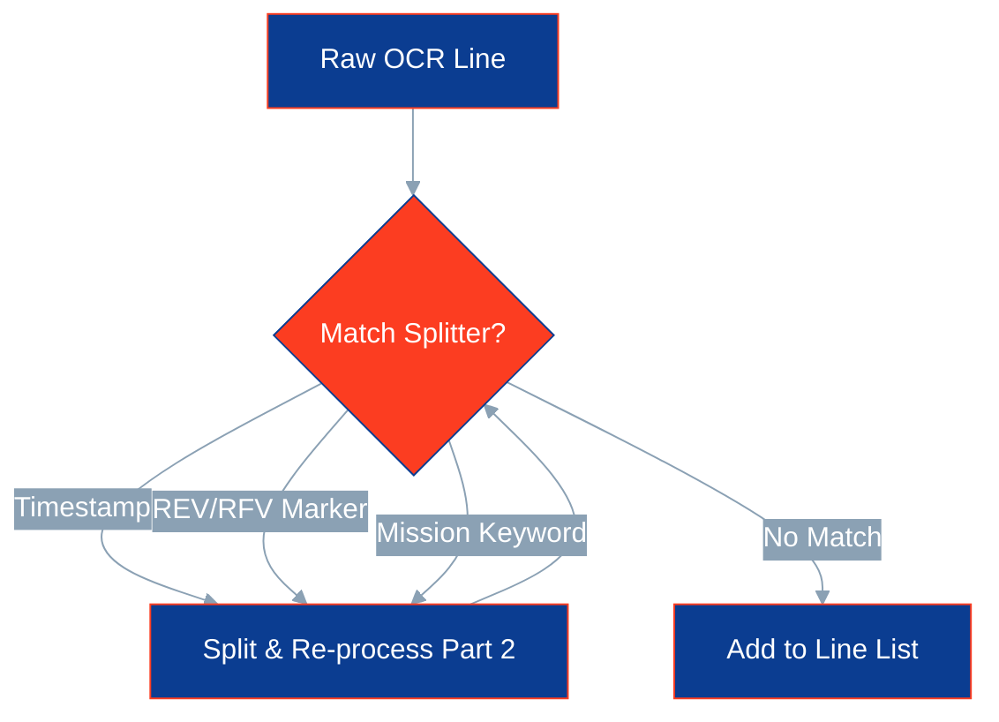
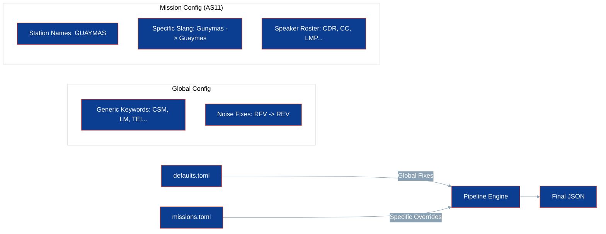

# Post-Processing & Text Intelligence

This document details the logic used to transform raw, noisy OCR output into structured, accurate, and human-readable NASA transcripts.

## Overview

The post-processing stage is where the "intelligence" of the pipeline resides. It handles layout reconstruction, error correction, and semantic enrichment through four main engines:

1.  **Block Parser**: Recovers the logical structure (Dialogue, Annotations, Headers).
2.  **Timestamp Engine**: Fixes OCR noise in timecodes and ensures chronological flow.
3.  **Speaker Corrector**: Standardizes caller IDs based on mission-specific rosters.
4.  **Text Intelligence (Lexicon)**: Corrects spelling using visual similarity and mission context.

---

## 1. The Block Parser (`ocr_parser.py`)

The parser uses a multi-pass approach to segment raw text.

### Iterative Line Splitting

Raw OCR often "glues" metadata to dialogue (e.g., `Roger. GRAND BAHAMA (REV 1)`). The parser applies an iterative splitting loop:

```mermaid
%%{init: {'theme': 'base', 'themeVariables': { 'primaryColor': '#0B3D91', 'primaryTextColor': '#fff', 'primaryBorderColor': '#FC3D21', 'lineColor': '#8BA1B4', 'secondaryColor': '#8BA1B4', 'tertiaryColor': '#fff'}}}%%
graph TD
    A[Raw OCR Line] --> B{Match Splitter?}
    B -- Timestamp --> C[Split & Re-process Part 2]
    B -- REV/RFV Marker --> C
    B -- Mission Keyword --> C
    B -- No Match --> D[Add to Line List]
    C --> B

    style B fill:#FC3D21,stroke:#0B3D91,color:#fff
```

### Block Classification Logic

Once lines are separated, they are classified based on context:

- **Comm**: A block starting with a timestamp.
- **Annotation**: Isolated mission keywords or revision markers.
- **Header/Footer**: Page/Tape info or specialized NASA markers.
- **Continuation**: Dialogue lines following a `Comm` block.

**Smart Merging**: Consecutive `Continuation` blocks are automatically merged into a single paragraph to ensure fluid readability in the final JSON.

---

## 2. Text Intelligence Engine (`text_corrector.py`)

Our correction engine goes beyond simple spell-checking by using a weighted scoring algorithm.

### Scoring Formula

To avoid "correcting" technical terms into common English words, we prioritize **Visual Similarity Ratio** over **Frequency**.

$$Score = (Similarity \times 10000) - (LengthDiff \times 500) + Frequency + ContextBonus$$

- **Similarity**: Calculated using the Gestalt Pattern Matching algorithm.
- **Length Penalty**: Penalizes candidates that change the word length significantly.
- **Mission Protection**: All `mission_keywords` are injected into the vocabulary with a high frequency floor to prevent them from being "fixed" (e.g., preventing `GUAYMAS` $\rightarrow$ `GUYS`).

### Context Awareness (Bigrams)

The engine analyzes word pairs. If a correction candidate forms a known technical bigram (e.g., `MASTER ALARM` instead of `WASTE ALARM`), it receives a `ContextBonus`.

---

## 3. Timestamp Recovery (`timestamp_corrector.py`)

OCR often misreads digits as punctuation. The engine uses aggressive regex to recover timecodes:

| OCR Noise     | Recovered     |
| :------------ | :------------ |
| `00 07 1) 41` | `00 07 10 41` |
| `OI 23 OO --` | `01 23 00 00` |
| `[1 45 : 32`  | `11 45 32 00` |

---

## 4. Configuration Hierarchy

The pipeline merges configurations to allow both global stability and mission-specific precision.

```mermaid
%%{init: {'theme': 'base', 'themeVariables': { 'primaryColor': '#0B3D91', 'primaryTextColor': '#fff', 'primaryBorderColor': '#FC3D21', 'lineColor': '#8BA1B4', 'secondaryColor': '#8BA1B4', 'tertiaryColor': '#fff'}}}%%
graph LR
    G[defaults.toml] -- Global Fixes --> P[Pipeline Engine]
    M[missions.toml] -- Specific Overrides --> P
    P --> Result[Final JSON]

    subgraph "Global Config"
    G1[Generic Keywords: CSM, LM, TEI...]
    G2[Noise Fixes: RFV -> REV]
    end

    subgraph "Mission Config (AS11)"
    M1[Station Names: GUAYMAS]
    M2[Specific Slang: Gunymas -> Guaymas]
    M3[Speaker Roster: CDR, CC, LMP...]
    end
```

## Performance Metrics

With this multi-layered approach, the pipeline currently achieves:

- **~95% Accuracy** on challenging Apollo 11 Technical Transcripts.
- **Perfect Structural Separation** between dialogue and ground station annotations.
- **Chronological Integrity** across multi-tape transitions.
