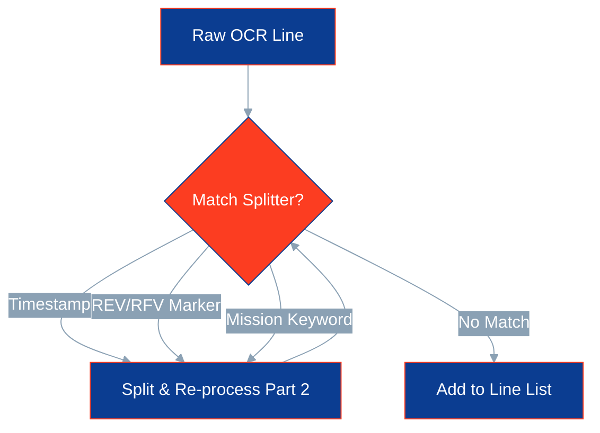
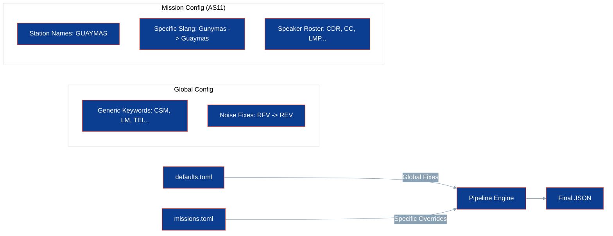

# Post-Processing & Text Intelligence

This document details the logic used to transform raw, noisy OCR output into structured, accurate, and human-readable NASA transcripts.

## Overview

The post-processing stage is where the "intelligence" of the pipeline resides. It handles layout reconstruction, error correction, and semantic enrichment through four main engines:

1.  **Block Parser**: Recovers the logical structure (Dialogue, Annotations, Headers) and can consume AI-tagged lines.
2.  **Timestamp Engine**: Fixes OCR noise in timecodes and ensures chronological flow.
3.  **Speaker Corrector**: Standardizes caller IDs based on mission-specific rosters.
4.  **Text Intelligence (Lexicon)**: Corrects spelling using visual similarity and mission context.

---

## 1. The Block Parser (`ocr_parser.py`)

The parser uses a multi-pass approach to segment raw text and extract metadata.

### Iterative Line Splitting

Raw OCR often "glues" metadata to dialogue (e.g., `Roger. GRAND BAHAMA (REV 1)`). The parser applies an iterative splitting loop:

```mermaid
%%{init: {'theme': 'base', 'themeVariables': { 'primaryColor': '#0B3D91', 'primaryTextColor': '#fff', 'primaryBorderColor': '#FC3D21', 'lineColor': '#8BA1B4', 'secondaryColor': '#8BA1B4', 'tertiaryColor': '#fff'}}}%%
graph TD
    A[Raw OCR Line] --> B{Match Splitter?}
    B -- Timestamp --> C[Split & Re-process Part 2]
    B -- REV/RFV Marker --> C
    B -- Mission Keyword --> C
    B -- No Match --> D[Add to Line List]
    C --> B

    style B fill:#FC3D21,stroke:#0B3D91,color:#fff
```

### Block Classification & Metadata

Once lines are separated, they are classified based on context. This happens via two paths:

- **AI tags (optional)**: When classification is enabled, each line is explicitly tagged as `HEADER`, `COMM`, `ANNOTATION`, `FOOTER`, or `META`.
- **Heuristic fallback**: If tags are absent or invalid, the parser uses keyword-based heuristics.

- **Comm**: A block starting with a timestamp.
- **Location Extraction**: Parenthesized lines like `(TRANQ)` are treated as locations and attached to the current or immediately preceding COMM block.
- **Annotation**: Isolated mission keywords or revision markers (e.g., `(REV 1)`).
- **Header/Footer**: Page/Tape info or specialized NASA markers; `***` lines are treated as footers and normalized to the canonical asterisks sentence.
- **Meta/Transition**: Lines such as `END OF TAPE` or `REST PERIOD - NO COMMUNICATIONS`.
- **Continuation**: Only used when a page begins with text lacking timestamp/speaker and the previous page ended with COMM.
- **Timestamp-List Mode**: When the OCR yields a run of timestamp-only lines (>=5) followed by the speaker/text column, the parser reconstructs the row alignment and assigns speakers, locations, and text to each timestamp.

**Smart Merging**: Consecutive `Continuation` blocks are automatically merged into a single paragraph to ensure fluid readability in the final JSON.

---

## 2. Text Intelligence Engine (`text_corrector.py`)

Our correction engine goes beyond simple spell-checking by using a weighted scoring algorithm.

### Scoring Formula

To avoid "correcting" technical terms into common English words, we prioritize **Visual Similarity Ratio** over **Frequency**.

$$Score = (Similarity \times 10000) - (LengthDiff \times 500) + Frequency + ContextBonus$$

- **Similarity**: Calculated using the Gestalt Pattern Matching algorithm.
- **Length Penalty**: Penalizes candidates that change the word length significantly.
- **Mission Protection**: All `mission_keywords` are injected into the vocabulary with a high frequency floor to prevent them from being "fixed" (e.g., preventing `GUAYMAS` $\rightarrow$ `GUYS`).

### Context Awareness (Bigrams)

The engine analyzes word pairs. If a correction candidate forms a known technical bigram (e.g., `MASTER ALARM` instead of `WASTE ALARM`), it receives a `ContextBonus`.

**Footer Handling**: Footer blocks are excluded from lexical correction so the canonical asterisk line is preserved.

---

## 3. Timestamp Recovery & Global Indexing (`timestamp_corrector.py`)

### Noise Handling

OCR often misreads digits as punctuation. The engine uses aggressive regex to recover timecodes, now supporting both 3-segment (`HH MM SS`) and 4-segment (`DD HH MM SS`) formats:

| OCR Noise     | Recovered     |
| :------------ | :------------ |
| `04 06 47`    | `04 06 47 00` |
| `00 07 1) 41` | `00 07 10 41` |
| `OI 23 OO --` | `01 23 00 00` |

### Global Chronological Index

To ensure perfect continuity across the entire mission, the pipeline maintains a `timestamps_index.json` file.

1.  **Cross-Page Context**: When processing a new page, the engine looks at the last valid timestamp of the previous page.
2.  **Tolerance Window**: Small backward slips (OCR hiccups) are preserved instead of rewritten.
3.  **Automatic Correction**: Missing or large out-of-order jumps are corrected by incrementing the last known timestamp by 1 second to maintain continuity.
4.  **Tagging**: Corrections are annotated as `timestamp_correction` (e.g., `out_of_order`, `inferred_missing`, `inferred_tens`, `inferred_suffix`, `corrected_jump`).

---

## 4. Header Page/Tape Reconstruction

Header `Page`/`Tape` lines from OCR are ignored and recalculated to avoid classification noise:

- `page`: computed from `page_offset` per mission.
- `tape`: starts at `1/1`, increments `y` each page, increments `x` after encountering `END OF TAPE` (and resets `y`).
- `END OF TAPE`: marked with `meta_type = "end_of_tape"`.

---

## 5. Right-Column OCR Pass

When `ocr_text_column_pass = true`, the pipeline runs a second OCR pass on the right-side text column.
Any `comm` blocks missing text are filled from this pass and merged into adjacent lines when they start with punctuation or lowercase.
Speaker/location-only lines and Page/Tape headers are filtered out of the column pass to avoid false fills.

---

## 6. Configuration Hierarchy

The pipeline merges configurations to allow both global stability and mission-specific precision.

```mermaid
%%{init: {'theme': 'base', 'themeVariables': { 'primaryColor': '#0B3D91', 'primaryTextColor': '#fff', 'primaryBorderColor': '#FC3D21', 'lineColor': '#8BA1B4', 'secondaryColor': '#8BA1B4', 'tertiaryColor': '#fff'}}}%%
graph LR
    G[defaults.toml] -- Global Fixes --> P[Pipeline Engine]
    M[missions.toml] -- Specific Overrides --> P
    P --> Result[Final JSON]

    subgraph "Global Config"
    G1[Generic Keywords: CSM, LM, TEI...]
    G2[Noise Fixes: RFV -> REV]
    end

    subgraph "Mission Config (AS11)"
    M1[Station Names: GUAYMAS]
    M2[Specific Slang: Gunymas -> Guaymas]
    M3[Speaker Roster: CDR, CC, LMP...]
    end
```

## Performance Metrics

With this multi-layered approach, the pipeline currently achieves:

- **~95% Accuracy** on challenging Apollo 11 Technical Transcripts.
- **Perfect Structural Separation** between dialogue and ground station annotations.
- **Chronological Integrity** across the entire document.
