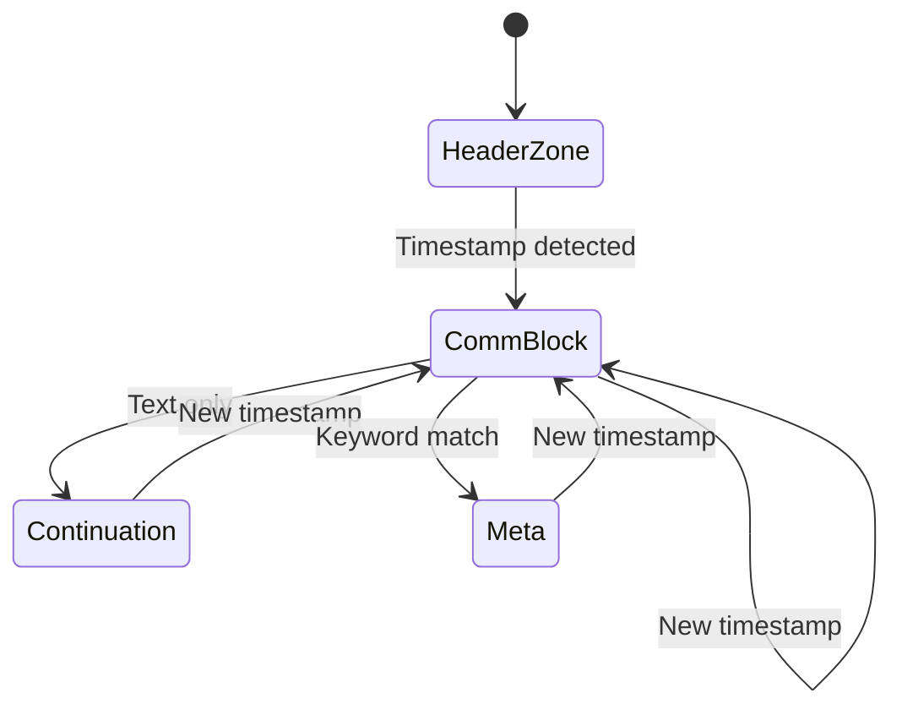
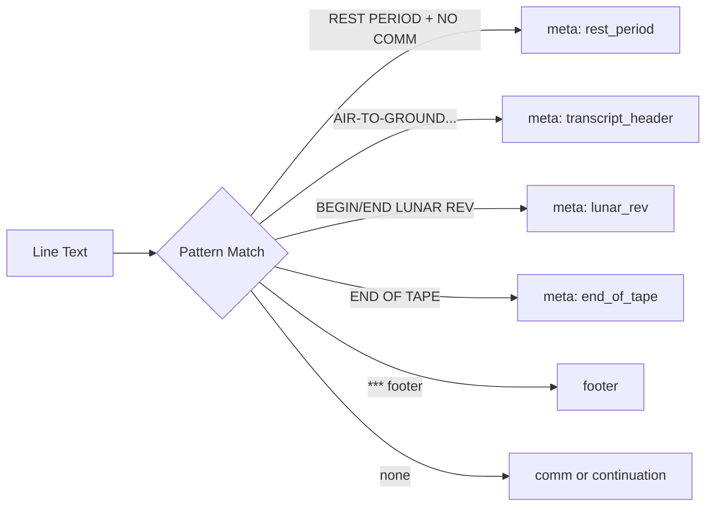
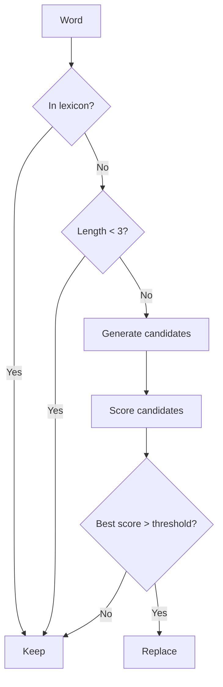

# Post-Processing & Text Intelligence

> Parsing algorithms and correction logic for transforming raw OCR into structured transcripts.

## Table of Contents

- [Overview](#overview)
- [Block Parser](#1-block-parser)
- [Text Correction](#2-text-correction)
- [Speaker Standardization](#3-speaker-standardization)
- [Timestamp Recovery](#4-timestamp-recovery)
- [Metadata Reconstruction](#5-metadata-reconstruction)
- [Global Timestamp Index](#6-global-timestamp-index)

---

## Overview


```mermaid
flowchart TD
    Input([Raw OCR Text]) --> Split[Line Splitting]
    Split --> Parser{Parser State Machine}

    subgraph Classification
        Parser -->|Timestamp prefix| Comm[Comm Block]
        Parser -->|Keywords| Meta[Meta/Header]
        Parser -->|Text only| Cont[Continuation]
    end

    subgraph "Correction Chain"
        Comm --> Spk[Speaker Corrector]
        Spk --> Time[Timestamp Corrector]
        Time --> Text[Text Corrector]
    end

    Cont --> Stitch[Smart Stitching]
    Meta --> Rules[Meta Rules]
    Text --> Stitch
    Rules --> Index[Update Index]

    Stitch --> Dead[Dead Reckoning]
    Dead --> Output([Final JSON])
```

---

## 1. Block Parser

**Module:** `src/ocr/ocr_parser.py`

The parser transforms raw OCR lines into structured JSON blocks using a state machine with regex heuristics.

### 1.1 Pre-processing: Line Splitting

Raw OCR often "glues" columns together. Before classification, the parser runs iterative splitting:

| Step | Operation |
|:-----|:----------|
| 1 | Strip LLM tags (e.g., `[COMM]`) → store as `forced_type` |
| 2 | Scan for embedded timestamps after index 12 |
| 3 | Scan for revision markers (e.g., `(REV 1)`) |
| 4 | Validate split points (must be followed by speaker/location) |
| 5 | Recurse: push right part back to queue for re-evaluation |

### 1.2 Parser State Machine

The parser iterates line-by-line, maintaining a buffer of pending fields (`ts`, `speaker`, `location`, `text`). It flushes a block when a new block start is detected.

#### Regex Reference

| Name | Pattern | Matches |
|:-----|:--------|:--------|
| `TIMESTAMP_STRICT_RE` | `^[\dOI'()]{2}\s+[\dOI'()]{2}\s+...` | `04 12 33 01` |
| `TIMESTAMP_PREFIX_RE` | `^([\dOI'()]{2}\s+...)\b` | Line start |
| `SPEAKER_LINE_RE` | `^[A-Z0-9]{1,8}(/[A-Z0-9]+)?...$` | `CDR`, `CMP` |
| `LOCATION_PAREN_RE` | `^\(([A-Z0-9\s]+)\)$` | `(TRANQ)` |
| `HEADER_PAGE_RE` | `\b(?:PAGE\|PLAY\|LAY)\s*(\d+)\b` | `Page 42` |

#### State Transitions


```mermaid
stateDiagram-v2
    [*] --> HeaderZone
    HeaderZone --> CommBlock: Timestamp detected
    CommBlock --> CommBlock: New timestamp
    CommBlock --> Continuation: Text only
    Continuation --> CommBlock: New timestamp
    CommBlock --> Meta: Keyword match
    Meta --> CommBlock: New timestamp
```

#### Core States

| State | Entry Condition | Action |
|:------|:----------------|:-------|
| **Header Zone** | Before first timestamp | Filter against `HEADER_KEYWORDS` |
| **Comm Block** | Line matches `TIMESTAMP_PREFIX_RE` | Extract timestamp, speaker, location, text |
| **Continuation** | No timestamp, no speaker, not meta | Append to `pending_text` |
| **Timestamp List Mode** | 5+ consecutive timestamp-only lines | Zip with subsequent text lines |

### 1.3 Meta Classification


```mermaid
flowchart LR
    A[Line Text] --> B{Pattern Match}
    B -->|REST PERIOD + NO COMM| R["meta: rest_period"]
    B -->|AIR-TO-GROUND...| H["meta: transcript_header"]
    B -->|BEGIN/END LUNAR REV| L["meta: lunar_rev"]
    B -->|END OF TAPE| E["meta: end_of_tape"]
    B -->|*** footer| F[footer]
    B -->|none| C[comm or continuation]
```

| Pattern | Meta Type | Additional Action |
|:--------|:----------|:------------------|
| `REST PERIOD - NO COMMUNICATIONS` | `rest_period` | Sets `page_type: rest_period` |
| `AIR-TO-GROUND VOICE TRANSCRIPTION` | `transcript_header` | Fuzzy-canonicalized |
| `BEGIN/END LUNAR REV N` | `lunar_rev` | Timestamp formatted as `DD HH MM --` |
| `END OF TAPE` | `end_of_tape` | Increments tape counter |
| `***` | — | Converted to footer block |

---

## 2. Text Correction

**Module:** `src/correctors/text_corrector.py`

Corrects spelling and artifacts using a domain-specific lexicon.

### 2.1 Noise Cleaning (Pre-processing)

Deterministic regex replacements:

| Pattern | Replacement | Purpose |
|:--------|:------------|:--------|
| `(\w+)-\s+([a-z]+)` | `\1\2` | Hyphenation repair |
| `\|`, `~`, stray colons | (removed) | Artifact removal |
| `minus 4.` | `minus 4.0` | Logic repair |
| `G()`, `(0` | `GO` | OCR artifact fix |

### 2.2 Correction Algorithm

For each word token:


```mermaid
flowchart TD
    A[Word] --> B{In lexicon?}
    B -->|Yes| K[Keep]
    B -->|No| C{Length < 3?}
    C -->|Yes| K
    C -->|No| D[Generate candidates]
    D --> E[Score candidates]
    E --> F{Best score > threshold?}
    F -->|Yes| R[Replace]
    F -->|No| K
```

#### Scoring Formula

```
Score = (Ratio × 10000) - (LengthDiff × 500) + Frequency + ContextBonus
```

| Factor | Description |
|:-------|:------------|
| **Ratio** | Gestalt pattern matching similarity (0.0–1.0) |
| **LengthDiff** | Penalty for changing word length |
| **Frequency** | Raw count from lexicon |
| **ContextBonus** | +100 if `(prev_word, candidate)` in bigrams |

---

## 3. Speaker Standardization

**Module:** `src/correctors/speaker_corrector.py`

Corrects speaker callsigns against a strict allowlist.

### Process

| Step | Operation |
|:-----|:----------|
| 1 | Normalize: remove all chars except alphanumeric and `/` |
| 2 | Recovery: if speaker empty but text starts with known token, extract it |
| 3 | Heuristics: `C`→`CC`, `CT`→`CMP`, strip parentheses |
| 4 | Fuzzy match: `difflib` with cutoff=0.5, prefer same-length |

### Valid Speakers (Apollo 11 Example)

```
CDR, CC, CMP, LMP, SC, HOUSTON, MS, MSFN, PAO, CT, HORNET, MCC
```

---

## 4. Timestamp Recovery

**Module:** `src/correctors/timestamp_corrector.py`

Ensures chronological continuity using a monotonic cursor.

### Error Correction Logic

When parsing timestamp T_curr against T_prev:

| Step | Condition | Action |
|:-----|:----------|:-------|
| **Noise normalization** | Always | `O`→`0`, `I`→`1`, `S`→`5`, `B`→`8` |
| **Inferred suffix** | OCR reads `04 12 33 ?` | Use T_prev seconds tens + hint |
| **Inferred tens** | OCR reads `10` but delta ≤ 0 | Add 40s offset ("50→10 fix") |
| **Backward slip** | T_curr < T_prev (< 300s) | Keep raw, don't update cursor, flag `out_of_order` |
| **Forward jump** | Delta > 12h | Force T_curr = T_prev + 1s, flag `corrected_jump` |
| **Missing** | No timestamp | Infer T = T_prev + 1s, flag `inferred_missing` |

### Timestamp Format

NASA transcripts use: `DD HH MM SS` (Day Hour Minute Second)

Example: `04 12 33 51` = Day 4, Hour 12, Minute 33, Second 51

---

## 5. Metadata Reconstruction

### 5.1 Dead Reckoning (Tape/Page)

The system ignores OCR-read page/tape numbers. Instead:

| Field | Calculation |
|:------|:------------|
| **Page** | Logical page index + mission offset |
| **Tape** | Starts at `1/1` when logical page reaches 1 (after `page_offset`). Y (reel) increments each page. X (tape) increments on `END OF TAPE` |

### 5.2 Smart Stitching

Merges `continuation` blocks into preceding `comm` blocks.

**Condition:** Current block is `continuation` AND previous is `comm`

**Merge rule:** If current text starts with lowercase or punctuation → append to previous text with space

---

## 6. Global Timestamp Index

**Module:** `src/correctors/timestamp_index.py`

Persistent on-disk index for cross-page timestamp continuity.

### Storage

`state/<stem>_timestamps_index.json`:

```json
{
  "1": ["04 12 33 01", "04 12 33 15", "04 12 33 28"],
  "2": ["04 12 34 02", "04 12 34 18"],
  ...
}
```

### Usage

| Operation | Purpose |
|:----------|:--------|
| `get_last_timestamp_before(N)` | Get cursor for page N correction |
| `update(N, timestamps)` | Store timestamps after OCR completes |

This enables:
- Timestamp correction across session restarts
- Parallel batch processing followed by sequential correction
