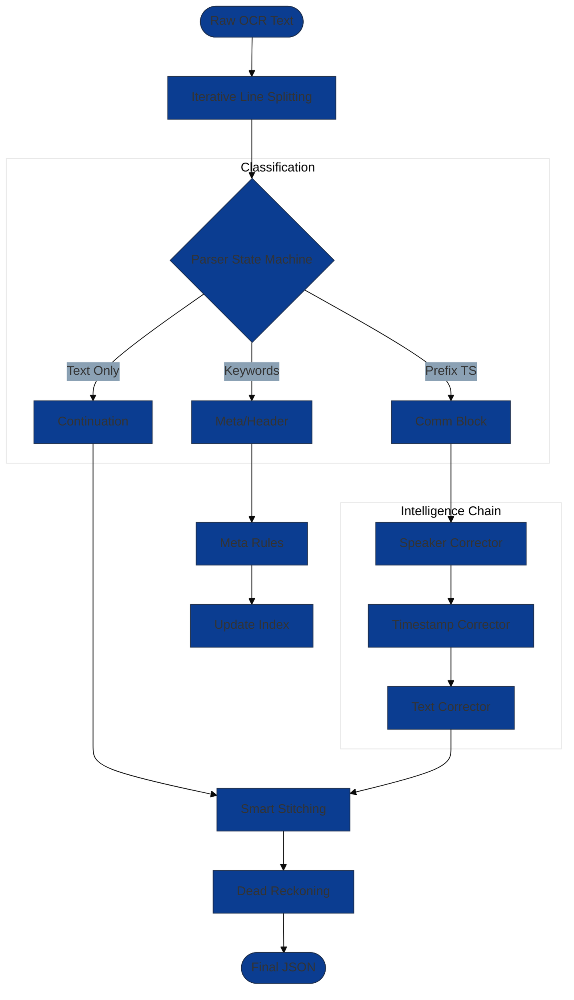
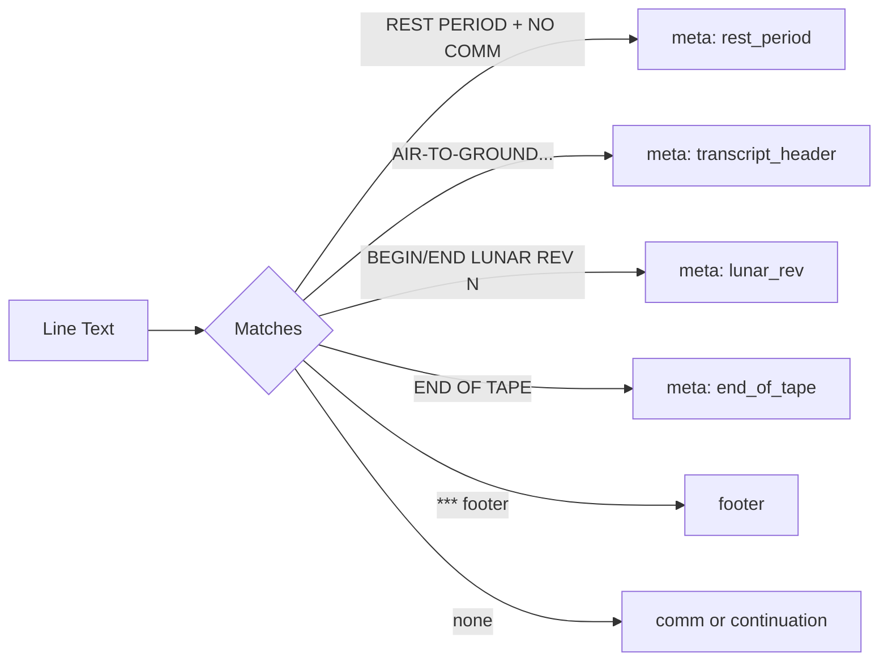

# Post-Processing & Text Intelligence

This document details the algorithmic logic used to transform raw OCR text into
structured NASA transcripts.

## Overview

<!-- markdownlint-disable MD013 -->

```mermaid
%%{init: {'theme': 'base', 'themeVariables': { 'primaryColor': '#0B3D91', 'secondaryColor': '#8BA1B4', 'tertiaryColor': '#fff' }}}%%
flowchart TD
    Input([Raw OCR Text]) --> Split[Iterative Line Splitting]
    Split --> Parser{Parser State Machine}

    subgraph Classification
        Parser -->|Prefix TS| BlockComm[Comm Block]
        Parser -->|Keywords| BlockMeta[Meta/Header]
        Parser -->|Text Only| BlockCont[Continuation]
    end

    subgraph Intelligence["Intelligence Chain"]
        BlockComm --> Spk[Speaker Corrector]
        Spk --> Time[Timestamp Corrector]
        Time --> Text[Text Corrector]
    end

    BlockCont --> Stitch[Smart Stitching]
    BlockMeta --> MetaRules[Meta Rules]
    MetaRules --> Index[Update Index]
    Text --> Stitch

    Stitch --> Meta[Dead Reckoning]
    Meta --> Output([Final JSON])
```
<!-- markdownlint-enable MD013 -->

## 1. The Block Parser (`src.ocr.ocr_parser`)

The parser is the core intelligence of the pipeline. It transforms a stream of
raw text lines (from the VLM) into structured JSON blocks using a complex State
Machine combined with Regex Heuristics.

### 1.1 Pre-processing: Iterative Line Splitting

Raw OCR outputs often "glue" columns together (e.g., `04 12 33 01 CDR Roger.`)
or bury metadata. Before classification, the parser runs an iterative splitting
loop:

1. **Tag Handling**: If lines come with LLM tags (e.g., `[COMM] ...`), the tag
   is stripped and stored as a `forced_type`.

2. **Embedded Component Detection**:
   - Scans each line for a **Timestamp** pattern (`TIMESTAMP_EMBEDDED_RE`)
     starting *after* character index 12.
   - Scans for **Revision Markers** (e.g., `(REV 1)`).
   - Scans for **Mission Keywords** (if configured).

3. **Validation Logic**:
   - A split is only performed if the text immediately following the embedded
     timestamp resembles a **Speaker Token** (`CDR`, `CMP`, `SC`) or a
     **Location** (`(TRANQ)`).
   - This prevents false positives where a timestamp might be mentioned in
     spoken text.

4. **Recursion**: If a split occurs:
   - The left part (`part1`) is finalized.
   - The right part (`part2`) is pushed back to the *front* of the processing
     queue to be re-evaluated (handling lines with multiple
     `TIMESTAMP SPEAKER TEXT` sequences).

### 1.2 The Parser State Machine

The parser iterates line-by-line, maintaining a buffer of `pending_` fields
(`ts`, `speaker`, `location`, `text`). It flushes a block when a new block
start is detected.

#### Regex Reference

| Name | Pattern | Matches |
| :--- | :--- | :--- |
| `TIMESTAMP_STRICT_RE` | `^[\dOI'()]{2}\s+[\dOI'()]{2}\s+...` | `04 12 33 01` |
| `TIMESTAMP_PREFIX_RE` | `^([\dOI'()]{2}\s+...)\b` | Start of line |
| `SPEAKER_LINE_RE` | `^[A-Z0-9]{1,8}(/[A-Z0-9]+)?...$` | `CDR`, `CMP` |
| `LOCATION_PAREN_RE` | `^\(([A-Z0-9\s]+)\)$` | `(TRANQ)` |
| `HEADER_PAGE_RE` | `\b(?:PAGE|PLAY|LAY)\s*(\d+)\b` | `Page 42`, `Play 473`, `Lay 473` |

#### Core States & Logic

1. **Header Zone**:
   - Any line before the *first* detected timestamp is a candidate for
     Header/Title metadata.
   - Filtered against `HEADER_KEYWORDS` (`GOSS`, `NET`, `APOLLO`).

2. **Accumulating Comm**:
   - **Entry**: Line matches `TIMESTAMP_PREFIX_RE` or `TIMESTAMP_STRICT_RE`.
   - **Action**:
     1. Flush any pending block.
     2. Extract Timestamp.
     3. Check remainder of line for `TIMESTAMP_SUFFIX_HINT`.
     4. Extract Speaker/Location from remainder.
     5. Remaining text goes to `pending_text`.
   - **State**: `prev_comm_like = True`.

3. **Continuation**:
   - **Entry**: Line has no timestamp, no speaker pattern, and isn't a
     Meta/Footer.
   - **Action**: Append text to `pending_text` of the current block.

4. **Timestamp List Mode** (Special Handling):
   - **Trigger**: A run of 5+ consecutive lines containing *only* timestamps.
   - **Scenario**: The OCR model recognized the "Timestamp Column" as a
     separate block of text from the "Speaker/Text Column".
   - **Logic**:
     - Enters `timestamp_list_mode`.
     - Iterates through subsequent non-timestamp lines.
     - Attempts to "zip" them: Line 1 text -> Timestamp 1, etc.
     - Intelligently handles multi-line text by checking if the next line
       looks like a Speaker (`SPEAKER_LINE_RE`).

5. **Meta/Footer Detection**:
   - `***` lines: Converted to canonical "Three asterisks..." footer.
   - Page/Tape headers (`Page`, `Play`, `Lay`, `Tape`) are ignored when they
     appear as standalone header-only lines.
   - `REST PERIOD - NO COMMUNICATIONS`: Tagged as `meta_type: rest_period`,
     and the page header gets `page_type: rest_period`.
   - `AIR-TO-GROUND VOICE TRANSCRIPTION`: Tagged as `meta_type: transcript_header`
     (fuzzy-canonicalized).
   - `BEGIN/END LUNAR REV N`: Tagged as `meta_type: lunar_rev` with
     timestamp formatted as `DD HH MM --`.

---

## Meta Classification Cheatsheet

```mermaid
flowchart LR
    A[Line Text] --> B{Matches}
    B -->|REST PERIOD + NO COMM| R[meta: rest_period]
    B -->|AIR-TO-GROUND...| H[meta: transcript_header]
    B -->|BEGIN/END LUNAR REV N| L[meta: lunar_rev]
    B -->|END OF TAPE| E[meta: end_of_tape]
    B -->|*** footer| F[footer]
    B -->|none| C[comm or continuation]
```
   - `END OF TAPE`: Marked as `meta_type="end_of_tape"`, triggers Tape
     counter increment.
   - `REST PERIOD`, `LOS`, `AOS`: Marked as `meta` type.

---

## 2. Text Intelligence Engine (`src.correctors.text_corrector`)

Corrects spelling and artifacts using a domain-specific lexicon
(`assets/lexicon/apollo11_lexicon.json`).

### 2.1 Noise Cleaning

Before algorithmic correction, deterministic regex replacements run:

- **Hyphenation Repair**: `(\w+)-\s+([a-z]+)` -> `\1\2`.
- **Artifact Removal**: Removes pipes `|`, tildes `~`, stray colons.
- **Logic Repair**: `minus 4.` -> `minus 4.0`.
- **OCR Artifacts**: `G()` -> `GO`, `(0` -> `GO`.

### 2.2 Correction Algorithm

For every word token:

1. **Vocabulary Check**: If word is in Lexicon or is a protected Mission
   Keyword, keep it.
2. **Short Word Guard**: If length < 3, ignore (unless numeric/symbol).
3. **Candidate Generation**: `difflib.get_close_matches` (cutoff 0.6).
4. **Scoring**:

$$
Score = (Ratio \times 10000) - (LengthDiff \times 500) + Freq + ContextBonus
$$

- **Ratio**: Gestalt pattern matching similarity (0.0 - 1.0).
- **LengthDiff**: Penalty for changing word length.
- **Frequency**: Raw count from lexicon.
- **ContextBonus**: +100 points if `(prev_word, candidate)` in bigrams.

---

## 3. Speaker Standardization (`src.correctors.speaker_corrector`)

Corrects speaker callsigns against a strict allowlist (`valid_speakers`).

### 3.1 Logic

1. **Normalization**: Removes all chars except alphanumeric and `/`.
2. **Extraction Recovery**: If `speaker` is empty but `text` starts with a
   known speaker token, move it.
3. **Heuristics**:
   - **Doubling**: `C` -> `CC`.
   - **OCR Fixes**: `CT` -> `CMP`.
   - **Parentheses**: `(CDR)` -> `CDR`.
4. **Fuzzy Matching**: `difflib` with `cutoff=0.5`. Prefer same-length
   candidates.

---

## 4. Timestamp Recovery (`src.correctors.timestamp_corrector`)

Ensures chronological continuity using a **Monotonic Cursor** (`last_valid_ts`).

### 4.1 Error Correction Logic

When parsing a timestamp $T_{curr}$ against $T_{prev}$:

1. **Noise Normalization**: `O`->`0`, `I`->`1`, `S`->`5`, `B`->`8`.
2. **Inferred Suffix**:
   - **Scenario**: OCR reads `04 12 33 ?`.
   - **Logic**: Use $T_{prev}.second$ tens digit + hint.
3. **Inferred Tens (The "50->10" Fix)**:
   - **Scenario**: OCR reads `10` but should be `50`.
   - **Logic**: If $\Delta \le 0$ AND adding 40s fits, apply offset.
4. **Monotonicity Enforcement**:
   - **Backward Slip**: If $T_{curr} < T_{prev}$ (by $< 300s$), keep raw
     text but don't update cursor. Flag: `out_of_order`.
   - **Forward Jump**: If $\Delta > 12h$, force $T_{curr} = T_{prev} + 1s$.
     Flag: `corrected_jump`.
5. **Missing Timestamp**:
   - Infer $T = T_{prev} + 1s$. Flag: `inferred_missing`.

---

## 5. Metadata Reconstruction & Merging

### 5.1 Dead Reckoning (Tape/Page)

The system ignores OCR-read page/tape numbers. Instead:

- **Page**: `Logical Page Index + Mission Offset`.
- **Tape**: Starts at `1/1`. Increments **Y** (Reel) every page. Increments
  **X** (Tape) on `END OF TAPE`.

### 5.2 Smart Stitching (Merging)

Merges `continuation` blocks into the preceding `comm` block.

**Merge Condition**:
If `Current.type == "continuation"` AND `Prev.type == "comm"`:

1. **Check Start**: Does `Current.text` start with lowercase or punctuation?
2. **Action**: If YES, merge into `Prev.text` with a single space.

---

## 6. Right-Column Fill Logic

If `ocr_text_column_pass = true`:

1. **Identify Gaps**: Find `comm` blocks where `text` is empty.
2. **Static Crop**: Extract region `x: [width * col2_end -> width]`.
3. **OCR**: Run with `TEXT_COLUMN_OCR_PROMPT`.
4. **Merge**: Zip remaining lines into empty `comm` blocks.

---

## 7. Global Timestamp Index (`src.correctors.timestamp_index`)

To handle the sequential processing constraint while processing pages in
parallel batches, the system uses a persistent on-disk index
(`state/<stem>_timestamps_index.json`).

- **Structure**: `{ page_num: [ts1, ts2, ... tsN] }`.
- **Usage**: Requests `get_last_timestamp_before(N)`.
- **Update**: Appended after OCR completes for Page $N$.
