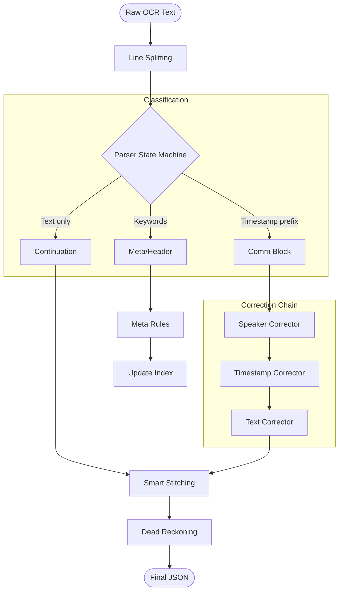
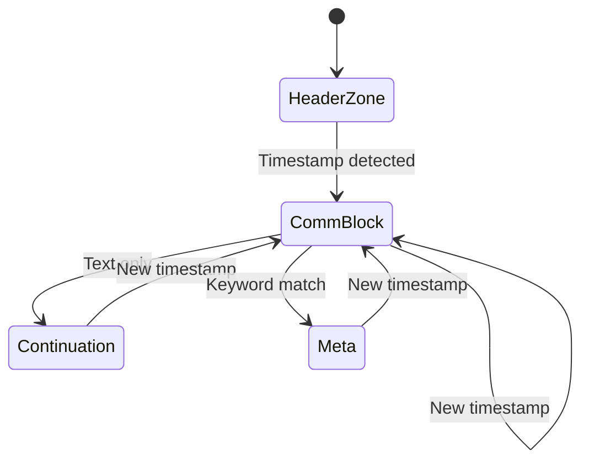
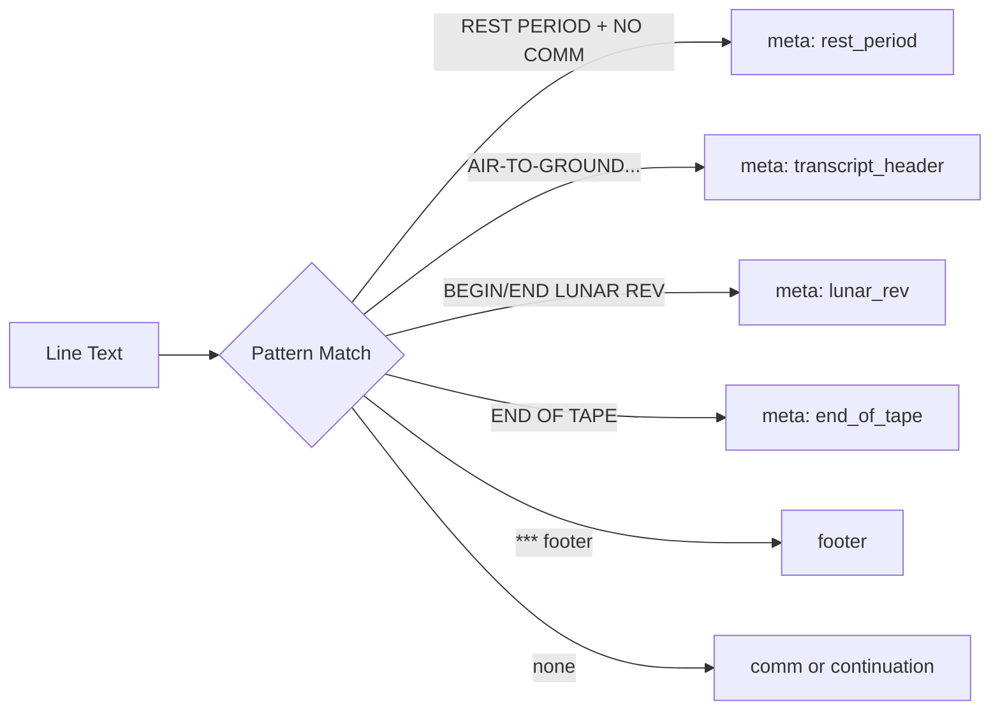
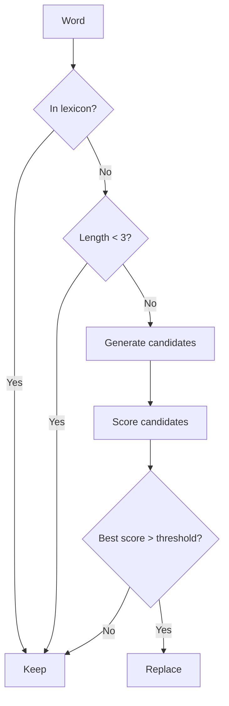

# Post-Processing & Text Intelligence

> Parsing algorithms and correction logic for transforming raw OCR into structured transcripts.

## Table of Contents

- [Overview](#overview)
- [Block Parser](#1-block-parser)
- [Text Correction](#2-text-correction)
- [Speaker Standardization](#3-speaker-standardization)
- [Location Correction](#4-location-correction)
- [Timestamp Recovery](#5-timestamp-recovery)
- [Metadata Reconstruction](#6-metadata-reconstruction)
- [Global Timestamp Index](#7-global-timestamp-index)
- [Advanced Timestamp Features](#8-advanced-timestamp-features)

---

## Overview


```mermaid
flowchart TD
    Input([Raw OCR Text]) --> Split[Line Splitting]
    Split --> Parser{Parser State Machine}

    subgraph Classification
        Parser -->|Timestamp prefix| Comm[Comm Block]
        Parser -->|Keywords| Meta[Meta/Header]
        Parser -->|Text only| Cont[Continuation]
    end

    subgraph "Correction Chain"
        Comm --> Spk[Speaker Corrector]
        Spk --> Time[Timestamp Corrector]
        Time --> Text[Text Corrector]
    end

    Cont --> Stitch[Smart Stitching]
    Meta --> Rules[Meta Rules]
    Text --> Stitch
    Rules --> Index[Update Index]

    Stitch --> Dead[Dead Reckoning]
    Dead --> Output([Final JSON])
```

---

## 1. Block Parser

**Modules:** `src/ocr/parsing/`

The parser transforms raw OCR lines into structured JSON blocks using a state machine with regex heuristics. Implementation is split across specialized modules:

- `patterns.py` — Regex patterns and constants
- `preprocessor.py` — Line splitting and cleaning
- `state_machine.py` — Core parsing logic
- `block_builder.py` — JSON construction with corrections

### 1.1 Pre-processing: Line Splitting

Raw OCR often "glues" columns together. Before classification, the parser runs iterative splitting:

| Step | Operation |
|:-----|:----------|
| 1 | Strip LLM tags (e.g., `[COMM]`) → store as `forced_type` |
| 2 | Scan for embedded timestamps after index 12 |
| 3 | Scan for revision markers (e.g., `(REV 1)`) |
| 4 | Validate split points (must be followed by speaker/location) |
| 5 | Recurse: push right part back to queue for re-evaluation |

### 1.2 Parser State Machine

The parser iterates line-by-line, maintaining a buffer of pending fields (`ts`, `speaker`, `location`, `text`). It flushes a block when a new block start is detected.

#### Regex Reference

| Name | Pattern | Matches |
|:-----|:--------|:--------|
| `TIMESTAMP_STRICT_RE` | `^[\dOI'()]{2}\s+[\dOI'()]{2}\s+...` | `04 12 33 01` |
| `TIMESTAMP_PREFIX_RE` | `^([\dOI'()]{2}\s+...)\b` | Line start |
| `SPEAKER_LINE_RE` | `^[A-Z0-9]{1,8}(/[A-Z0-9]+)?...$` | `CDR`, `CMP` |
| `LOCATION_PAREN_RE` | `^\(([A-Z0-9\s]+)\)$` | `(TRANQ)` |
| `HEADER_PAGE_RE` | `\b(?:PAGE\|PLAY\|LAY)\s*(\d+)\b` | `Page 42` |

#### State Transitions


```mermaid
stateDiagram-v2
    [*] --> HeaderZone
    HeaderZone --> CommBlock: Timestamp detected
    CommBlock --> CommBlock: New timestamp
    CommBlock --> Continuation: Text only
    Continuation --> CommBlock: New timestamp
    CommBlock --> Meta: Keyword match
    Meta --> CommBlock: New timestamp
```

#### Core States

| State | Entry Condition | Action |
|:------|:----------------|:-------|
| **Header Zone** | Before first timestamp | Filter against `HEADER_KEYWORDS` |
| **Comm Block** | Line matches `TIMESTAMP_PREFIX_RE` | Extract timestamp, speaker, location, text |
| **Continuation** | No timestamp, no speaker, not meta | Append to `pending_text` |
| **Timestamp List Mode** | 5+ consecutive timestamp-only lines | Zip with subsequent text lines |

### 1.3 Meta Classification


```mermaid
flowchart LR
    A[Line Text] --> B{Pattern Match}
    B -->|REST PERIOD + NO COMM| R["meta: rest_period"]
    B -->|AIR-TO-GROUND...| H["meta: transcript_header"]
    B -->|BEGIN/END LUNAR REV| L["meta: lunar_rev"]
    B -->|END OF TAPE| E["meta: end_of_tape"]
    B -->|*** footer| F[footer]
    B -->|none| C[comm or continuation]
```

| Pattern | Meta Type | Additional Action |
|:--------|:----------|:------------------|
| `REST PERIOD - NO COMMUNICATIONS` | `rest_period` | Sets `page_type: rest_period` |
| `AIR-TO-GROUND VOICE TRANSCRIPTION` | `transcript_header` | Fuzzy-canonicalized |
| `BEGIN/END LUNAR REV N` | `lunar_rev` | Timestamp formatted as `DD HH MM --` |
| `END OF TAPE` | `end_of_tape` | Increments tape counter |
| `***` | — | Converted to footer block |

---

## 2. Text Correction

**Module:** `src/correctors/text_corrector.py`

Corrects spelling and artifacts using a domain-specific lexicon.

### 2.1 Noise Cleaning (Pre-processing)

Deterministic regex replacements:

| Pattern | Replacement | Purpose |
|:--------|:------------|:--------|
| `(\w+)-\s+([a-z]+)` | `\1\2` | Hyphenation repair |
| `\|`, `~`, stray colons | (removed) | Artifact removal |
| `minus 4.` | `minus 4.0` | Logic repair |
| `G()`, `(0` | `GO` | OCR artifact fix |

### 2.2 Correction Algorithm

For each word token:


```mermaid
flowchart TD
    A[Word] --> B{In lexicon?}
    B -->|Yes| K[Keep]
    B -->|No| C{Length < 3?}
    C -->|Yes| K
    C -->|No| D[Generate candidates]
    D --> E[Score candidates]
    E --> F{Best score > threshold?}
    F -->|Yes| R[Replace]
    F -->|No| K
```

#### Scoring Formula

```
Score = (Ratio × 10000) - (LengthDiff × 500) + Frequency + ContextBonus
```

| Factor | Description |
|:-------|:------------|
| **Ratio** | Gestalt pattern matching similarity (0.0–1.0) |
| **LengthDiff** | Penalty for changing word length |
| **Frequency** | Raw count from lexicon |
| **ContextBonus** | +100 if `(prev_word, candidate)` in bigrams |

---

## 3. Speaker Standardization

**Module:** `src/correctors/speaker_corrector.py`

Corrects speaker callsigns against a strict allowlist.

### Process

| Step | Operation |
|:-----|:----------|
| 1 | Normalize: remove all chars except alphanumeric and `/` |
| 2 | Recovery: if speaker empty but text starts with known token, extract it |
| 3 | Heuristics: `C`→`CC`, `CT`→`CMP`, strip parentheses |
| 4 | Fuzzy match: `difflib` with cutoff=0.5, prefer same-length |

### Valid Speakers (Apollo 11 Example)

```
CDR, CC, CMP, LMP, SC, HOUSTON, MS, MSFN, PAO, CT, HORNET, MCC
```

---

## 4. Location Correction

**Module:** `src/correctors/location_corrector.py`

Validates and corrects location fields against mission-specific allowlists, filtering out invalid annotations.

### Process

| Step | Operation |
|:-----|:----------|
| 1 | Normalize: uppercase, remove non-alphanumeric (except spaces) |
| 2 | Exact match: check if normalized value is in valid_locations |
| 3 | Filter invalid annotations: remove known non-location terms (LAUGHING, GARBLE, etc.) |
| 4 | Filter timestamps: remove values that look like timestamps (>50% digits) |
| 5 | Fuzzy match: try `difflib.get_close_matches` with cutoff=0.7 |
| 6 | Filter short strings: remove single characters or 2-char strings (likely OCR noise) |

### Invalid Location Annotations

Configured in `config/defaults.toml`:

```toml
[pipeline_defaults.correctors.invalid_location_annotations]
annotations = [
    "LAUGHING", "LAUGHTER", "LAUGH",
    "GARBLE", "GARBLED",
    "PAUSE", "PAUSED",
]
```

These terms are annotations about audio quality/events, not actual locations. The LocationCorrector filters them out.

### Valid Locations (Apollo 11 Example)

```
EAGLE, COLUMBIA, TRANQ, EVA
```

**Note:** EVA appears in the HTML reference but not in the original PDF. It was added editorially.

---

## 5. Timestamp Recovery

**Module:** `src/correctors/timestamp_corrector.py`

Ensures chronological continuity using a monotonic cursor.

### Noise Normalization

Extended character mapping to handle OCR artifacts:

| OCR Character | Corrected To | Common Context |
|:--------------|:-------------|:---------------|
| `O`, `o`, `C`, `c` | `0` | Zero misread as letter O or C |
| `I`, `i`, `l` | `1` | One misread as letter I or L |
| `S`, `s` | `5` | Five misread as letter S |
| `B`, `b` | `8` | Eight misread as letter B |
| `°` | `0` | Degree symbol as zero |
| `:`, `?`, `.`, `/` | (removed) | OCR noise in timestamps |
| `'` | (removed) | Apostrophe artifact |
| `(`, `)` | `0` | Parentheses as zero |

Example: `"04 12 11 :6"` → `"04 12 11 06"`

### Day Correction

Common OCR errors in the day field (first component):

| OCR Value | Correction | Reason |
|:----------|:-----------|:-------|
| `94` | `04` | "0" misread as "9" |
| `55` | `05` | "0" misread as "5" |
| `> 10` | `mod 10` | Any impossible day value |

Example: Mission elapsed time can't exceed ~8 days for Apollo 11.

### Error Correction Logic

When parsing timestamp T_curr against T_prev:

| Step | Condition | Action |
|:-----|:----------|:-------|
| **Noise normalization** | Always | Apply character mapping (see above) |
| **Day correction** | Always | Fix 94→04, 55→05, >10→mod 10 |
| **Sequence reset** | T_curr < T_prev by >1h AND stable run detected | Accept T_curr, flag `sequence_reset` |
| **Hour snapping** | Delta > 1h OR backward slip | Try snapping to T_prev.hour ± {0,1} if delta becomes 0-600s |
| **Inferred suffix** | OCR reads `04 12 33 ?` | Use T_prev seconds tens + hint |
| **Inferred tens** | OCR reads `10` but delta ≤ 0 | Add 40s offset ("50→10 fix") |
| **Backward slip** | T_curr < T_prev (< 300s) | Keep raw, don't update cursor, flag `out_of_order` |
| **Forward jump** | Delta > 12h | Force T_curr = T_prev + 1s, flag `corrected_jump` |
| **Missing** | No timestamp | Infer T = T_prev + 1s, flag `inferred_missing` |

### Correction Flags

| Flag | Meaning |
|:-----|:--------|
| `sequence_reset` | Large backward jump accepted (validated by stable run) |
| `corrected_hour` | Hour field repaired via snapping algorithm |
| `inferred_suffix` | Seconds digit inferred from context |
| `inferred_tens` | Tens digit corrected (50→10 fix) |
| `inferred_monotonic` | Adjusted to maintain monotonic order |
| `inferred_missing` | Timestamp was missing, inferred from previous |
| `out_of_order` | Timestamp is out of order (kept as-is) |
| `corrected_jump` | Large forward jump was corrected |

### Timestamp Format

NASA transcripts use: `DD HH MM SS` (Day Hour Minute Second)

Example: `04 12 33 51` = Day 4, Hour 12, Minute 33, Second 51

---

## 5. Metadata Reconstruction

### 5.1 Dead Reckoning (Tape/Page)

The system ignores OCR-read page/tape numbers. Instead:

| Field | Calculation |
|:------|:------------|
| **Page** | Logical page index + mission offset |
| **Tape** | Starts at `1/1` when logical page reaches 1 (after `page_offset`). Y (reel) increments each page. X (tape) increments on `END OF TAPE` |

### 5.2 Smart Stitching

Merges `continuation` blocks into preceding `comm` blocks.

**Condition:** Current block is `continuation` AND previous is `comm`

**Merge rule:** If current text starts with lowercase or punctuation → append to previous text with space

---

## 6. Global Timestamp Index

**Module:** `src/correctors/timestamp_index.py`

Persistent on-disk index for cross-page timestamp continuity.

### Storage

`state/<stem>_timestamps_index.json`:

```json
{
  "1": ["04 12 33 01", "04 12 33 15", "04 12 33 28"],
  "2": ["04 12 34 02", "04 12 34 18"],
  ...
}
```

### Usage

| Operation | Purpose |
|:----------|:--------|
| `get_last_timestamp_before(N)` | Get cursor for page N correction |
| `add_timestamps(N, timestamps)` | Store timestamps after OCR completes |
| `save()` | Persist index to disk |

This enables:
- Timestamp correction across session restarts
- Parallel batch processing followed by sequential correction
- Fast reparse without re-running OCR (uses cached timestamps)

---

## 8. Advanced Timestamp Features

### 8.1 Hour Snapping Algorithm

**Purpose**: Repair OCR misreads in the hour field when minute/second look plausible.

**Method**: `_hour_snap(current_ts, last_ts)`

When a timestamp appears incorrect (large delta or backward jump), the algorithm:

1. **Checks same-day constraint**: Only attempts if `current_ts.day == last_ts.day`
2. **Generates candidates**: Tests `last_ts.hour + {0, -1, +1}`
3. **Validates delta**: Each candidate must have `0 < delta ≤ 600s` from last_ts
4. **Selects best**: Chooses candidate with smallest positive delta
5. **Applies correction**: Updates timestamp and flags `corrected_hour`

**Example**:
- Last: `04 22 45 30`
- Current (OCR): `04 12 46 15` (hour misread as "12" instead of "22")
- Delta with hour=12: -10h 45m (invalid)
- Try hour=22: +45s ✓
- Result: `04 22 46 15` with flag `corrected_hour`

### 8.2 Sequence Reset Detection

**Purpose**: Detect intentional backward jumps (e.g., replays, alternate timelines) vs OCR errors.

**Method**: `has_stable_run(start_idx)`

When encountering a large backward jump (> 1 hour):

1. **Look ahead**: Scan next 6 blocks for timestamps
2. **Collect candidates**: Find at least 3 timestamps
3. **Validate monotonicity**: Each must be > previous
4. **Validate spacing**: Deltas must be ≤ 600s
5. **Accept reset**: If stable run found, accept backward jump as intentional

**Example**:
- Current sequence: `04 22 45 30`, `04 22 46 00`, `04 22 46 15`
- New timestamp: `03 10 12 00` (13h backward!)
- Look ahead finds: `03 10 12 15`, `03 10 12 30`, `03 10 13 00` (stable run ✓)
- Result: Accept `03 10 12 00` as `sequence_reset`

This prevents false corrections when transcripts include replayed audio or alternate timelines.

### 8.3 Timestamp Preprocessing

**Module**: `src/ocr/parsing/preprocessor.py`

**Function**: `normalize_timestamp_noise(line)`

Pre-normalizes timestamp-like patterns BEFORE parsing:

**Pattern**: `TIMESTAMP_ANY_SEP_RE`

Matches 4 groups of 1-2 characters (including OCR noise chars like C, S, B) separated by any non-timestamp characters.

**Example**:
- Input: `"05:00:05:15 GO"`
- Match: groups = `('05', '00', '05', '15')`
- Normalize each: `05` (pad singles), map C→0, S→5, B→8
- Output: `"05 00 05 15 GO"`

This ensures even heavily corrupted timestamps can be recognized and parsed correctly.

### 8.4 Embedded Timestamp Detection

**Module**: `src/ocr/parsing/block_builder.py`

**Functions**: `split_embedded_timestamp_blocks()`, `EMBEDDED_TIMESTAMP_RE`

Some transcripts have multiple timestamps/speakers in a single OCR line. The parser:

1. **Detects embedded patterns**: `EMBEDDED_TIMESTAMP_RE` matches `DD HH MM SS` mid-line
2. **Splits blocks**: Creates separate comm blocks for each embedded timestamp
3. **Preserves order**: Maintains chronological sequence
4. **Extracts components**: Parses timestamp, speaker (if present), and text for each

**Example**:
```
Input OCR: "04 12 33 01 CDR Roger. 04 12 33 15 CC Copy that."
```

Splits into:
```json
[
  {"timestamp": "04 12 33 01", "speaker": "CDR", "text": "Roger."},
  {"timestamp": "04 12 33 15", "speaker": "CC", "text": "Copy that."}
]
```

### 8.5 Continuation Merging

**Module**: `src/ocr/parsing/block_builder.py`

**Function**: `clean_or_merge_continuations(blocks)`

Merges non-leading continuation blocks into previous blocks:

- **Preserves embedded timestamps**: Blocks containing timestamps are never merged
- **Detects duplicates**: Exact duplicates or substrings are dropped
- **Smart merging**: Appends text to previous block with spacing

This cleans up OCR artifacts where single sentences are split across multiple lines.

### 8.6 Inline Annotation Merging

**Module**: `src/ocr/parsing/block_builder.py`

**Function**: `merge_inline_annotations(blocks, inline_terms)`

Merges standalone annotation tags into preceding comm blocks:

- **Identifies annotations**: Checks if block text matches invalid_location_annotations
- **Merges into comm**: Appends to previous comm block's text
- **Converts orphans**: Standalone annotations become comm blocks if no previous block

**Example**:
```
Before:
- Block 1: {type: "comm", speaker: "CDR", text: "Houston we have"}
- Block 2: {type: "annotation", text: "GARBLED"}

After:
- Block 1: {type: "comm", speaker: "CDR", text: "Houston we have GARBLED"}
```
