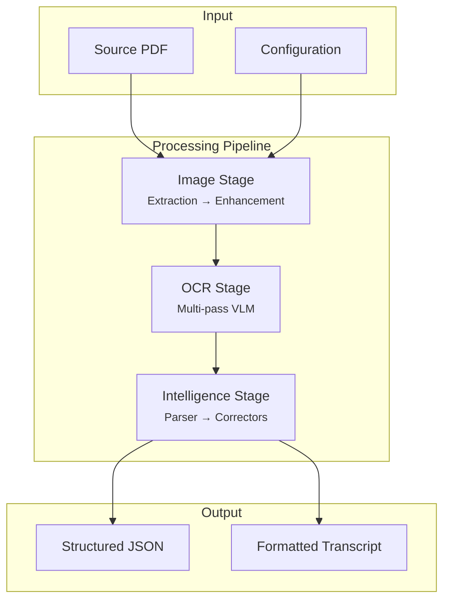

# Documentation Index

> Technical documentation for the NASA Transcript Processing Pipeline.

## Quick Navigation

| Document | Description |
|:---------|:------------|
| [Architecture](ARCHITECTURE.md) | System design, data structures, and module responsibilities |
| [Pipeline](PIPELINE.md) | Image processing stages and OCR strategy |
| [Post-Processing](POST_PROCESSING.md) | Text intelligence, parsing algorithms, and correction logic |
| [Configuration](CONFIGURATION.md) | Complete reference for all configuration options |
| [Schemas](SCHEMAS.md) | JSON Schema definitions for output validation |

## Overview Diagram



## Documentation Map

### For Users

1. Start with the main [README](../README.md) for installation and CLI usage
2. See [Configuration](CONFIGURATION.md) for customizing behavior

### For Understanding the System

1. [Architecture](ARCHITECTURE.md) — High-level design and data flow
2. [Pipeline](PIPELINE.md) — Image processing algorithms
3. [Post-Processing](POST_PROCESSING.md) — Text parsing and correction
4. [Schemas](SCHEMAS.md) — Output format specifications

## File Structure

```
docs/
├── README.md           # This index
├── ARCHITECTURE.md     # System design
├── PIPELINE.md         # Processing stages
├── POST_PROCESSING.md  # Text intelligence
├── CONFIGURATION.md    # Config reference
└── SCHEMAS.md          # JSON Schema docs

schemas/
├── page.schema.json    # Page output validation
└── merged.schema.json  # Merged output validation
```
